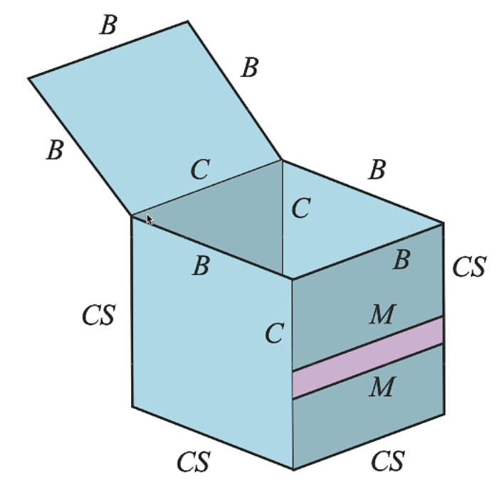
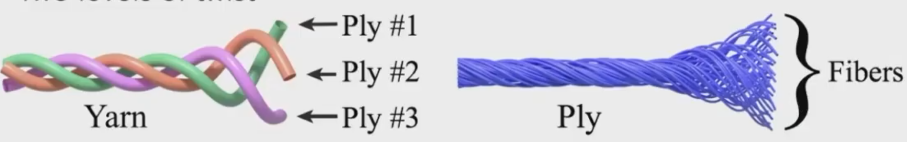

# PBR

## [实时]基于物理的材质 PBR

在实时渲染领域，Physically-Based Rendering一般即指材质。但它们基本都不是physically based的，做了大量简化和hack。

对表面一般有两类：

- 微表面模型 Microfacet Models
- Disney Principled BRDFs

对Volumes，则通常可分为以下两类：

- single scattering
- multiple scattering(for cloud, hair, skin, etc.)

## Cook-Torrance模型

什么是PBR？

PBR的性质：

- 双向传播
  $$
  \rho(V,L)=\rho(L,V)
  $$

- 能量守恒

  能量可以拆成两个部分：漫反射部分和高光反射部分。
  $$
  \rho(V,L)=kK_d+(1-k)\rho_s(V,L)
  $$

Cook-Torrance光照模型：将物体表面表面视为一个个微小的随机排布，其理想镜面反射受FDG三项控制
$$
f_r(w_o,w_i)=\frac{k_d}{\pi}+\frac{k_s}{4\pi(n\cdot w_i)}D(h)F(w_o)G(w_o,w_i)
$$

CT模型：

- 漫反射BRDF：一定是个常数

  - 若完全不吸收，全部反射出去

  $$
  dC_R=\rho_0C_E(L)(N\cdot L)dw\\
  C_R=\int_\Omega\rho_0C_E(L)(N\cdot L)dw\\
  C_R=\rho_0C_R\int_{H^2}cos\theta_idw\\
  \rho_0=\frac{1}{\pi}
  $$

  - 若存在吸收
    $$
    \rho_0=\frac{K_d}{\pi}
    $$
    其中Kd是漫反射的衰减系数，物理含义即漫反射颜色。

- 镜面反射BRDF

  - $F(\omega_o)$菲涅尔现象

    给定入射光线角度和材质信息，求反射的比例（水面垂直的看通透，斜看如镜子）

    Schlick对F的近似估计：
    $$
    入射角为0°时,\,\,F_0=(\frac{\eta_\lambda-1}{\eta_\lambda+1})^2\\
    F_{Schlick}=F_0+(1-F_0)(1-cos\theta_d)^5
    $$

  - $G(w_0,w_i)$表面自遮挡
    $$
    \int_\Omega G_1(m,v)D(m)(v\cdot m)^+dm=v\cdot n
    $$
    表示宏观投影结果等于正面投影结果之和$(v\cdot m)^+$

    

    对于CT模型，照到一个微平面的光线可能会被相邻的微平面遮挡，微表面的反射光线也可能会被相邻微表面遮挡。

    而CT模型无法在G项描述对微平面进行二次反射。

  - $D(w_o)$

    法线分布函数(Normal Distribution Function)，其代表了所有微观角度下微小镜面法线的分布情况，粗糙表面法线分布相对均匀，光滑表面法线分布相对集中。
    
    微平面分布函数是用来描述微平面上法向量与半程向量H相同的比例，即用来描述法向量方向和H相同的微平面数量/面积
    $$
    dA_h=D(\omega_h)d\omega_hdA
    $$
    在H方向入射的辐射通量为：
    $$
    d\Phi=C_i(\omega_i)cos\theta_hd\omega_idA_h=C_i(\omega_i)d\omega_icos\theta_hD(\omega_h)d\omega_hA
    $$
    忽略F，G的影响，可以认为入射的辐射通量等于出射的辐射通量。
    
    根据Radiance定义
    $$
    dC_R(\omega_R)=\frac{d\Phi_R}{d\omega_Rcos\theta_RdA}=\frac{C_i(\omega_i)d\omega_icos\theta_hD(\omega_h)d\omega_hA}{d\omega_Rcos\theta_RdA}
    $$
    
    根据BRDF的定义，可得到高光反射的BRDF：
    $$
    \rho_s=\frac{\mathrm{d}C_R}{C_icos\theta_i\mathrm{d}\omega_i}=\frac{cos\theta_hD(\omega_h)\mathrm{d}\omega_h}{cos\theta_Rcos\theta_i\mathrm{d}\omega_R}
    $$
    代入立体角积分公式
    $$
    \mathrm{d}\omega=\frac{\mathrm{d}A}{r^2}=sin\varphi \mathrm{d}\theta\mathrm{d}\varphi
    $$
    由于出射方向和观察方向重合，半程向量恰为反射光线的对称轴，则角度翻倍：（为什么要代入？）
    $$
    \mathrm{d}\omega_h=sin\theta_h \mathrm{d}\theta_h\mathrm{d}\phi\\
    \mathrm{d}\omega_R=sin(2\theta_h) \mathrm{d}(2\theta_h)\mathrm{d}\phi\\
    \frac{\mathrm{d}\omega_h}{\mathrm{d}\omega_R}=\frac{1}{4cos\theta_h}
    $$
    将12带入到10中，则得到了
    $$
    \rho_s=\frac{D(\omega_h)}{4cos\theta_Rcos\theta_i}
    $$
    加入F、G的影响，则得到
    $$
    \rho_s=\frac{D(h)F(w_o)G(w_o,w_i)}{4cos\theta_Rcos\theta_i}
    $$

## 微表面模型

微表面模型（Microfacet Material）是更接近于物理的材质描述，相比于Lambertian模型、Phong模型，它可以用来描述更复杂的场景。我们认为广表面（Macrosurface） 是平坦且粗糙的，但是微表面（Microsurface）是凹凸不平但是光滑的（每一个小的面都是光滑平坦的）。 粗糙的广表面是由一个个微表面组成，微表面是完美的平面，其朝向不同。对于微表面模型，整体的光线反射情况应当是所有微表面反射情况的总和。从近处看是几何，从远处看就是一种材质。

广表面的粗糙程度取决于微表面的法线的方差，法线方差越大，广表面越粗糙。

对于微表面的不同材质，可以考虑通过微表面法线分布进行表示：
$$
f(i,o)=\frac{F(i,h)G(i,o,h)D(h)}{4(n,i)(n,o)}
$$
其中$F(i,h)$即菲涅尔项Fresnel Term，$G(i,o,h)$是几何项 Shadowing-masking term，，$D(h)$是沿着半程向量的法线分布。

- 菲涅尔项

  菲涅尔项告诉我们有多少能量被反射，这取决于入射角。在入射角几乎垂直的时候，很少能量会反射；如果斜着看则效果会很明显。

  菲涅尔项在物理上需要考虑光线的极化（s极化和p极化），最后呈现极化的综合效果。当我们同时有一个简单的估计：Schlick's approximation
  $$
  R(\theta)=R_0+(1-R_0)(1-cos\theta)^5\\
  R_0=(\frac{n_1-n_2}{n_1+n_2})^2
  $$

- 法线分布函数

  对于微表面模型，最重要的实际是微表面自身的法线分布NDF（Normal Distribution Function）。对于任何一种材质，我们使用法线分布来描述其材质。如果是光滑glossy的表面，那么法线分布比较集中；否则，法线会分布在四处，呈现出类似diffuse的效果。

  有不同的模型可以描述这样的分布，如Beckmann、GGX等模型。

  - Beckmann NDF

    即一个法线方向的函数，它类似于Gaussian高斯函数，它定义在坡度空间Slope Space上（保证微表面的面不会朝下）：
    $$
    D(h)=\frac{e^{-\frac{tan^2\theta_h}{\alpha^2}}}{\pi\alpha^2cos^4\theta_h}
    $$
    其中，$\alpha$描述法线的粗糙程度，粗糙程度越小效果越接近镜面反射。$\theta_h$则是半程向量$h$和法线$n$的夹角。

  - GGX/Trowbridge-Reitz NDF

    函数图像的突出特征在于其“长尾巴”，会呈现出“光晕”的效果：

    

    - Extending GGX: GTR(Generalized Trowbridge-Reitz)

      “更长的尾巴”

      

  - **Shadowing-Masking Term**

    几何项G，用于解决微表面间的自遮挡问题。提供了变暗的操作。在接近垂直方向时，不会变暗；在接近grazing angle时，会剧烈减小。

    

    Decoupling shadowing and masking:
    $$
    G(i,o,m)\approx G_1(i,m)G_1(o,m)
    $$

  - **问题：能量损失**

    在不同的roughness下，会有不同的能量损失。在rough时会损失更多能量。

    越粗糙的表面，在表面多次弹射的可能性越大，也就会有更多的能量损失。

    在离线渲染领域的解决方案是在微表面上实现一个类似于光线追踪的东西。

    实时渲染则采用Kulla-Conty近似，其核心思路在于“被遮挡则会发生下次弹射”。

    我们首先计算弹射出的总能量：
    $$
    E(\mu_o)=\int^{2\pi}_0\int^1_0f(\mu_o,\mu_i,\phi)\mu_id\mu_id\phi,\mu=sin\theta
    $$
    对于某种BRDF，我们只需补上$1-E(\mu_o)$的能量即可。也即我们补上另外一种BRDF使其积分出来的能量等于$1-E(\mu_o)$。同时我们需要考虑其对称性，也即它的形式有：
    $$
    c(1-E(\mu_i))(1-E(\mu_o))
    $$
    其中$c$是用于归一化的量：
    $$
    f_{ms}(\mu_o,\mu_i)=\frac{(1-E(\mu_o))(1-E(\mu_i))}{\pi(1-E_{avg})},E_{avg}=2\int^1_0E(\mu)\mu d\mu
    $$
    代入可验证。

    此时$E_{avg}(\mu_o)=2\int^1_0E(\mu_i)\mu_id\mu_i$仍旧是未知的，为了减少计算成本，我们可以预计算/打表。

    $E_{avg}$仅依赖于参数$\mu_o$和*roughness*，我们可以对这两个数算出所有的组合（一张二维表）。

    

    如果原本的BRDF有颜色，颜色意味着吸收了某些光，也就意味着能量损失。我们仍是只需要计算总体能量。

    我们定义一个平均分量Frensel，用于表示平均每次有多少能量被反射：
    $$
    F_{avg}=\frac{\int^1_0F(\mu)\mu d\mu}{\int^1_0\mu d\mu}=2\int^1_0F(\mu)\mu d\mu
    $$
    我们可以直接看到的能量即$F_{avg}E_{avg}$；再一次反射后即$F_{avg}(1-E_{avg})\cdot F_{avg}E_{avg}$；第k次反射后即$F^k_{avg}(1-E_{avg})^k\cdot F_{avg}E_{avg}$，将所有可能的能量相加则有级数：
    $$
    \frac{F_{avg}E_{avg}}{1-F_{avg}(1-E_{avg})}
    $$
    即颜色项Color Term。

- Linearly Transformed Cosines (LTC)

  线性变换的余弦，解决的是微表面模型的Shading问题。

  从某一方向看去，得到2D BRDF lobe，后者可以通过某种线性变换得到一个余弦函数。

  Pass

## Disney principled BRDF

Microfacet不擅长表示某些真实材质，不能模拟所有真实材质。

同时，它对于artist而言并不友好，它基于物理，有很多物理参量，并不适合艺术家的设计。对此，我们需要一个artist friendly的材质，其代表就是Disney principled BRDF。

它基于以下重要原则设计：

1. 效果直观，利于艺术家使用
2. 尽量少的参数
3. 参数的可取值在0-1的范围内，利于调节
4. 所有参数的组合是鲁棒的，都可以得到确定的结果

Disney principled BRDF的设计，在很多时候都是建立在拟合的基础上，所以是能量守恒的，是经验性的。

它提供了很多参数，允许基于直观设计出各种效果。但同时，参数空间越大越容易造成冗余。同时，过大的参数空间难以去学习和训练。

它有开源实现。这并不是基于物理的，但我们仍旧称之为PBR材质。

## Non-Photorealistic Rendering(NPR)

NPR即非真实感渲染，是风格化的。它快速而可靠，是一种轻量级的解决方式。

非真实感渲染需要制造一种artistic appearences的效果，它基于真实感渲染做了一些改变。

- Outline Rendering

  

  B: Boundary

  C:Crease

  M:Material edge

  S: Silhouette edge

  

  描边的思路：

  - Shading

    

    

  - 后期处理

# 外观建模

## 非表面模型

有些散射介质或参与介质在空间中，它

## 布料外观

Cloth的制作原理：一系列缠绕的纤维构成的

不同的纤维经过第一次缠绕可以成为Ply，不同的Ply再经过缠绕成为线Yarn

我们可以把它当成物体表面进行渲染。

相比于认为是平面上定义的，我们也可以把织物认为是空间中分布的体积，则可划分为超极细小的格子，将布料当成反射介质进行体积渲染，它的计算量大但可以有较好的效果。

另一个思路，我们知道了纤维的缠绕方式，那么我们可以把每一股纤维渲染出来。它的计算量也是很大的。

# 材质初级

核心问题：材质和光照是如何作用的？

BRDF直接决定物体材质。Material == BRDF.

## Diffuse / Lambertian Material 漫反射材质

漫反射材质：任何一个光线打到一个点上，可以均匀分布在空间当中。

原先在Bulin-Phong中定义了漫反射系数，如今考虑在实际材质中的定义。

如果物体不吸收光，则进出的irridiance是相等的。此时$L_i=L_o$，则有$f_{BRDF}=1/\pi$。

推广到一般，定义albedo反射率$\rho$满足$0\leq\rho\leq1$，则可体现出不同颜色。

即：
$$
f_r=\frac{\rho}{\pi}\\\rho - 反射率\,albedo(color)
$$

## Glossy Material 抛光

抛光的金属，类似于古代的铜镜

## Ideal reflective / refractive  material

同时包含反射与折射的材质。Example：玻璃/水。

## Perfect Specular Reflection 反射

反射公式的书写：

按性质，入射方向和出射方向的正中方向应该是法线方向。按平行四边形法则即得等式。按已知入射光和法线方向，即可得出射光。

另一种方法，将角度投影到局部坐标中。$\theta=0$时是沿着法线方向，$\theta=\pi/2$是水平向右。

## Specular Refraction 折射

仍旧是几何光学的描述，不涉及波，只是定义了不同的波长不同的折射率。

**折射：Snell’s Law 折射定律**

如果根号下小于0，则折射不存在。也即，如果入射介质折射率大于折射介质折射率，则没有折射（全反射现象）。

**Snell’s Window / Circle**

**Fresnel Reflection / Term** 菲涅尔项

$\theta=0\ \ R(\theta)=1;\theta=\pi/2\ \ R(\theta)=0$

## Microfacet Material 微表面模型/微表面材质

离得很远时，很多材质细节都无法看到，只能看到材质整体对光的作用。

远处：平的macro；近处：凹凸不平的细节micro

Microfacet BRDF

对于微表面的不同材质，可以考虑通过微表面法线分布进行表示

略过略过不学辣

区分材质的方式

Isotropic / Anisotropic Materials (BRDFs)

各向同性/各向异性材质

各向同性：各个方面基本分布是均匀的，没有明显方向性

各向异性：有明显方向性

BRDF如果不满足在方位角上旋转，则称为各向异性材质（如果旋转后看到的是相同的BRDF，则同性，否则异性）

## Advanced Light Transport

  高级光线传播

- 无偏光线传播
- 有偏光线传播
