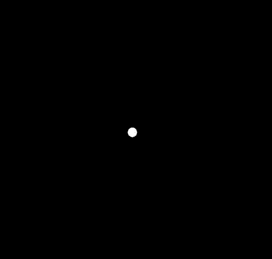

# 目录

[TOC]


# Rasterization 光栅化

Several Basic Conception: 

**What is a screen?**

- an array of pixel(‘FYI’)

- Size of the array: resolution

- A typical kind of raster display

  (raster means screen in German. raserize means ‘drawing onto the screen’)

**What is pixel?**

- Color is a mixture of (red, green, blue)
- Pixels’ indices are from  (0, 0) to (width - 1, height - 1)
- Pixel (x, y) is centered at (x + 0.5, y + 0.5)
- The screen covers range  (0, 0) to (width, height)

**Canonical Cube to Screen**

1. Irrelevant to z

2. Transform in xy plane: $[-1, 1]^2$ to [0, width] x [0, height]

   Viewport transform matrix:

$$
M_{view}=
\begin{bmatrix}
\frac {width}{2}&0&0&\frac {width}{2}\\
0&\frac {height}{2}&0&\frac {height}{2}\\
0&0&1&0\\
0&0&0&1
\end{bmatrix}
$$

## Rastering one Triangles

Triangles: Fundamental Shape Primitives

**Why triangles?**

- Most basic polygon
  - Break up other polygons
  - Unique property
- Unique properties
  - Graranteed to be planar
  - Well-defined interior

**What Pixel Values Approximate a Triangle?**

- A Simple Approach: **Sampling**

  We can <u>discretize</u> a function by sampling. Sample if Each Pixel is inside triangle.

  1. Define binary function: inside(t,x,y)

     return 1 if Point (x,y) in triangle t, or return 0

     **Realization:** The Cross Products 

     $\vec {P_1P_2} \times \vec {P_1Q} > 0$ if Q is locating left side of $\vec {P_1P_2}$

     

     We could realize inside() after 3 times judgement.

     *Edge Cases: it depends*

  2. Sampling a 2D indicator function

     ```cpp
     for (int x = 0; x < xmax; ++x) 
     	for (int y = 0; y < ymax; ++y) 
     		image[x][y] = inside(tri,x + 0.5,y + 0.5);
     ```

     **Optimize**: no need to checking all pixels on the screen

     - check each vertex before use a Bouding Box(AABB).

     - Suitable for thin and rotated triangles.

## Sampling Theory 采样原理

采样对象：不同位置（将图像信息离散为像素），不同时间（将连续过程离散成每一帧）

Sampling Artifacts (Errors, Mistakes, Inaccuracies): 

- Jaggies - sampling in space
- Moire Patterns - undersampling images
- Wagon Wheel Effect - sampling in time

Sampling：Repeating  Frequency Contents

### Frequency Domain 频域

**Fourier Transform**: Represent a function as a weighted sum of sines and cosines


### Flitering 滤波 (Convolution, Averaging)

**Filter 滤波**: Getting rid of certain frequency contents

Fourier Transform: 时域 -> 频域（中心：最低频区域；周围：最高频区域）


> - High-pass filter (Filter Out Low Frequencies Only, Edges) 高通滤波     
>
> - Low-pass fliter (Filter Out High Frequencies Only, Blur) 低通滤波     
>
> - Filter Out Low and High Frequencies 
>
>     


**Convolution 卷积**在图形学上的简化定义：

对原始信号对应位置的值及其周围位置的值作加权平均，结果是其卷积后对应位置的值。

**Convolution Theorem**: 

Convolution in the spatial domain is equal to multiplication in the frequency domain, and vice versa

时域上的卷积对应频域上的乘积

> Option 1:
>
> - Filter by convolution in the spatial domain
>
> Option 2:
>
> - Transform to frequency domain (Fourier transform) 时域到频域
> - Multiply by Fourier transform of convolution kernel 频域进行乘积
> - Transform back to spatial domain (inverse Fourier) 频域还原到时域


## Antialiasing 反走样

**Aliases 走样**: Two frequencies that are indistinguishable at a given sampling rate.

Blurring (Pre-Filtering) Before  Sampling 模糊/滤波 后再采样

Aliasing: Mixed Frequency Contents

> How Can We Reduce Aliasing Error?
>
> Option 1: Increase sampling rate
>
> - Essentially increasing the distance between replicas in the  Fourier domain
>
> - Higher resolution displays, sensors, framebuffers…
>
>   But: costly & may need very high resolution
>
> Option 2: Antialiasing
>
> - Making Fourier contents “narrower” before repeating
>
>   i.e. **Filtering out high frequencies before samplin**


> Antialiasing By Averaging Values in Pixel Area
>
> Solution: 
>
> - Convolve f(x,y) by a 1-pixel box-blur (low pass, blurring)
>
>   Recall: convolving = filtering = averaging
>
> - Then sample at every pixel’s center

In rasterizing one triangle, the average value inside a pixel  area of f(x,y) = inside(triangle,x,y) is equal to the area of the  pixel covered by the triangle.


#### Antialiasing By Supersampling  (MSAA)

> Step 1: Take NxN samples in each pixel.
>
> Step 2: Average the NxN samples “inside” each pixel.
>
> 

The Cost of MSAA: 更多的计算量


更多的抗锯齿方案：

- FXAA(Fast Approximate AA) 得到含锯齿的图像，通过图像匹配找到锯齿边界，进行后期替换
- TAA(Temporal AA) 根据上一帧信息进行合成

Super Resolution（超分辨率，将高分图进行还原）

- From low resolution to high resolution
- Essentially still “not enough samples” problem
- DLSS (Deep Learning Super Sampling)

## Visibility/Occlusion 可见性

> Z-Buffer
>
> - Store current min. z-value for each sample (pixel)
> - Needs an additional buffer for depth values 
>   - frame buffer stores color values
>   - depth buffer (z-buffer) stores depth
>
> *IMPORTANT: For simplicity we suppose  z is always positive*
>
> *(smaller z -> closer, larger z -> further)*

 **Z-Buffer Algorithm**

Initialize depth buffer to $\infty$

```python
for(each triangle T)
    for(each sample(x,y,z) in T)
    	if(z<zbuffer[x,y])				//如果更浅
        	framebuffer[x,y] = rgb;		//更新颜色
            zbuffer[x,y] = z;			//更新深度
        else
```

默认深度为无限大，每一个像素内记录最浅深度与颜色，从而维护出逐像素的渲染结果/深度图。


Z-Buffer Complexity 复杂度：O(n) for n triangles


# Ray Tracing

## Ray tracing 光线追踪

Whitted-Style Ray Tracing

> Why Ray Tracing？
>
> Cons: Accurate
>
> ​	comparing to rasterizer, Ray tracing could  handle global effects.
>
> - soft shadow 软阴影
> - glossy reflection 高斯模糊的反射效果
> - Indirect illumination 间接光照（到人眼之前，光线弹射可以不止一次）
>
> Pros: very slow

Rasterizer: real-time; Ray tracing: offline


### 基本光线追踪原理

**Light Rays 光线**

三点假设：

1. 光线沿直线传播
2. 光线与光线不会发生碰撞，互不相干
3. 光线由光源出发到达眼睛（可逆的：目光由眼睛出发到达光源，光路不改变）

光线追踪：从相机开始

**Ray Casting 光线投射**

从照相机开始，向成像平面image plane投射出一道光线eye ray(primary ray)，打到光线所经过的最近的物体（和场景中物体的**最近一点**）。

考虑该点是否会被照亮，从该点向光源连接一根光线，若光线没有物体阻挡，则该点为亮；否则为暗。


#### Recursive (Whitted-Style) Ray Tracing 递归光追


#### Ray-object intersections

**求解：光线到物体表面的交点 Ray-Surface Intersection**

> <u>**Ray 光线**</u>
>
> Ray is defined by its orgin and a direction vector. Ray Equation: 
>
> 
>
> **<u>Sphere 球</u>**
>
> 
>
> **光线和球的交点：**
>
> 联立展开，
>
> $t=\frac{-b\pm\sqrt{b^2-4ac}}{2a}$解二次函数
>
> **求解：光线到隐式表面的交点**
>
> 对于$r(t)=\vec o + t\vec d$到隐式表面$p:f(p)=0$，只需解出$f(\vec o+t\vec d)=0$


**判断：一个点是否在物体内部**

> 对于一个点，作过点的光线（射线），如果光线与几何形体的交点数为奇数，则在物体内部；如果是偶数，则在物体外。适用于2D与3D。


**光线与三角形求交 Ray Intersection With Triangle Mesh**

> <u>Method 1</u>: Simple idea
>
> - just intersect ray with each triangle (Simple, but slow)
>
> <u>Method 2</u>: 分解为两个问题：光线与平面求交；判断点是否在三角形内insideTriangle
>
> - 点法式定义平面：只须由$p:(p - p^\prime)N=0$ 来给定平面，其中$p\prime$是平面上任意一点，$N$是平面法向量。
>
>   带入$p=r(t)=o+td$即可得$t=\frac{(p\prime-o)N}{dN}$
>
> <u>Method 3</u>: Moller Trumbore Algorithm
>
> - $\vec O+t\vec D=(1-b_1-b_2)\vec P_0+b_1\vec P_1+b_2\vec P_2$
>
>   使用Cramer法则得到解，判断解是否合理
>
>   （$t$为正，点在三角形内即$b_1,b_2,(1-b_1-b_2)$都是非负的）


### Accelerate 加速结构

#### Bounding Volumes 包围盒

用一个盒子将物体包起来，如果光线连包围盒都碰不到，是不可能碰到物体的。

如果盒子是长方体，长方体即三个对面(3 pairs of slabs)形成的交集。

通常考虑**<u>轴对齐包围盒(Axis-Aligned Bounding Box, AABB)</u>** 。

判断光线与盒子是否有交点

2D example:


The ray <u>enters</u> the box <u>only when</u> it enters all pairs of slabs;

The ray <u>exits</u> the box <u>as long as</u> it exits any pair of slabs.

- However, ray is not a line 

  Should check whether t is negative for physical correctness!

- What if texit < 0?

  The box is “behind” the ray — no intersection!

- What if texit >= 0 and tenter < 0?

  The ray’s origin is inside the box — have intersection!

- In summary, ray and AABB intersect iff(当且仅当)

  $t_{enter} < t_{exit} $&&$ t_{exit} >= 0$

轴对齐时，各种计算会相对容易。


#### 使用AABB加速光追

（预处理方法）

1. Find bounding box

2. Create grid（将盒子划分为格子）

3. Store each object in overlapping cells（判断哪些格子中有物体）

4. 做若干次光线与盒子的求交，若相交再判断是否和物体相交

   （为了效率，也就要求格子不能太稀疏也不能太密集）

   

##### Uniform Spatial Partitions (Girds) 空间划分


Oct-Tree 八叉树（二维情况下是四叉树，计算复杂度与维度有关）

**KD-Tree** 每次只沿轴进行<u>一次划分</u>，讨论对象

BSP-Tree 不横平竖直的AABB（计算复杂度与维度有关）


KD-Tree 的建立：

Internal nodes store

- split axis: x-, y-, or z-axis

- split position: coordinate of split plane along axis

- children: pointers to child nodes

- No objects are stored in internal nodes

  Leaf nodes store list of objects


Traversing a KD-Tree


KD-Tree 的问题：

难以判定物体和包围盒相交。给定AABB包围盒，难以判断它与一个平面中的哪些三角形有交集。

物体可能在多个格子中。


##### Object Partitions 物体划分

对应的加速结构：**Bounding Volume Hierarchy (BVH)**

1. 找到一个包围盒
2. 递归，按照物体将包围盒拆成两个部分
3. 重新计算子部分的包围盒
4. Stop when necessary

(Store objects in each leaf)


BVH中，每一个几何结构只存在于一个对应节点当中。但如何划分是一个问题。

如何划分：按照不同维度划分节点。

​	Heuristic#1: 每一次划分中，总是沿着最长轴进行划分。

​	Heuristic#2: 选取中间物体median object进行划分。（让这个树更平衡）

对于动态场景，只能重新计算BVH。


**BVH Traversal**

```
Intersect(Ray ray, BVH node) {
 	if (ray misses node.bbox) return;
 	
    if (node is a leaf node)
 		test intersection with all objs;
		return closest intersection;
 	
    hit1 = Intersect(ray, node.child1);
	hit2 = Intersect(ray, node.child2);

    return the closer of hit1, hit2;
}
```


**Spatial vs Object Partitions**

Spatial partition (e.g.KD-tree)

- Partition space into  non-overlapping regions
- An object can be contained  in multiple regions 

Object partition (e.g. BVH)

- Partition set of objects into  disjoint subsets
- Bounding boxes for each set  may overlap in space


### Basic radiometry 辐射度量学

*Way of learning things:* 

*Why learn? What it is? How to use?*

为什么讨论Radiometry？

对于光进行精准的定义和描述，最终重现真正的物理法则。

辐射度量学：描述真实的光照。但仍旧基于几何光学（光沿直线传播，无干涉等现象）。

#### Radiant Energy and Flux (Power)

Definition: **Radiant energy** is the energy of electromagnetic  radiation. It is measured in units of joules, and denoted by  the symbol 
$$
Q[J=Joule]
$$
Definition: **Radiant flux (power)** is the energy emitted,  reflected, transmitted or received, per unit time.单位时间的Radiant energy，功率
$$
\Phi = \frac{dQ}{dt}[W=Watt][lm=lumen]^\star
$$
Flux: 单位时间通过某感光平面的光子数量。


讨论三个对象：光源辐射能量，物体表面接收能量，光线传播中能量的度量


#### Radiant Intensity

Definition: The **radiant (luminous) intensity** is the power per unit  solid angle (立体角) emitted by a point light source.一个立体角上的能量（单位时间）
$$
I(\omega)\equiv\frac{d\phi}{d\omega} [\frac{W}{sr}][\frac{lm}{sr}=cd=candela]
$$


**Angles and Solid Angles**

> **Angle**: 
>
> - ratio of subtended arc length on circle to radius $\theta=\frac{l}{r}$ (circle has $2\pi$ radians)
>
> **Solid Angle**: 
>
> - $\Omega = \frac{A}{r^2}$ (Sphere has $4\pi$ <u>steradians</u>)
>
> **differential solid angles**（单位立体角/微分立体角）：
>
> -  $A/r^2$。单位立体角的积分是$4\pi$
>
> 

**Isotropic Point Source**

某一方向上的强度


#### Irradiance

Definition: The irradiance is the **power per unit area** incident  on a surface point.


关联Blinn-Phong Model中的Lambert’s Cosine Law。

在Irradiance Falloff模型中，衰减的不是intensity， 是irradiance。

#### Radiance

Radiance is the fundamental field quantity that describes the  distribution of light in an environment.

Definition: The radiance (luminance) is the **power** emitted,  reflected, transmitted or received by a surface, **per unit solid  angle, per projected unit area**. 从某个方向打到某个面上，面接受的能量。


Difference among three def:

- Irradiance: power per projected unit area

- Intensity: power per solid angle 

- Radiance: Irradiance per solid angle

  Radiance: Intensity per projected unit area

Difference between Irradiance and Radiance:

- Irradiance: total power received by area $dA$

- Radiance: power received by area $dA$ from “direction” $d\omega$


### BRDF 双向反射分布函数

**Bidirectional Reflectance Distribute Function（BRDF，双向反射分布函数）**

BRDF可以描述在反射过程中从某个方向进来、向某个方向分散时反射能量的多少(如何向每个方向分配能量)，也即描述光线与物体是如何作用的。

“BRDF”定义了材质。


**Reflection at a Point**

（理解）反射：光线从某个角度打到物体某个位置上，被表面吸收后再向外发出。

Radiance -> Irradiance -> Radiance


由此推导出渲染方程。


考虑的radiance可能不止来自某一特定光源，也可能是其它物体的漫反射（二次反射），这是一个递归的问题。

**The Rendering Equation 渲染方程**

一个点的光=自己发的+反射别人的

$$
L_r(p,\omega_o)=L_e(x,\omega_o)+\int_{\Omega^+(H^2)} L_i(x,\omega_i)f(p,\omega_i,\omega_o)(\omega_i\cdot n)\,d\omega_i
$$


点光源场景：


面光源场景：


对于方程：

可以简写为(u,v是两个不同位置)：
$$
l(u)=e(u)+\int l(v)K(u,v)dv\\
或\\
L=E+KL\\
（所有能量等于所有光源辐射出来的能量加上辐射出来被反射的能量）
$$
其中$K(u,v)dv$是Kernel of equation

推导时，写成算子形式，可以方便Taylor展开：
$$
L=E+KL\\(I-K)L=E\\L=(I-K)^{-1}E\\L=(I+K+K^2+K^3+...)E （泰勒展开）\\L=E+KE+K^2E+K^3E+...(*)
$$
物理意义上的理解：L=光源+光源弹射一次+光源弹射两次+…

另一种理解：Ratserization可以做到的就是$E+KE$，而Ray Tracing可以做到更多项的效果。

### 概率论与蒙特卡洛积分

**Probability**

1. 随机变量radom variable与概率分布 $X$~$p(x)$

2. Probabilities 概率 $p_i\geq 0, \sum_{i=1}^{n} p_i=1$

3. 期望 Expected Value of a Radom Variable $E[X]$

4. 连续情况描述概率分布：概率密度函数Probability Density Function (PDF)

   $X$~$p(x)$。PDF满足归一化性质。

**积分方法：蒙特卡洛积分 Monte Carlo Integration**

积分域内不断采样，对每一个划分出的近似的长方形进行积分。


具体操作：

1. 定义积分：Define integral $\int_a^bf(x)dx$
2. PDF采样：Uniform random variavle $X_i$~$p(x)=\frac{1}{b-a}$
3. 除N求平均，得到对定积分的估计Basic Monte Carlo estimator $F_N=\frac{b-a}{N}\sum_{i=1}^Nf(X_i)$

In general:
$$
\int f(x)dx=\frac{1}{N}\sum^N_{i=1}\frac{f(X_i)}{p(X_i)}\quad X_i\sim p(x)
$$
Some notes:

- The more samples, the less variance
- Sample on x, integrate on x

### Path Tracing 路径追踪

Motivation: Whitted-Style Ray Tracing

Progress: 对于glossy材质，不能沿镜面反射；全局光照


解出渲染方程：
$$
L_o(p,\omega_o)=\int_{\Omega^+} L_i(p,\omega_i)f_r(p,\omega_i,\omega_o)(\omega_i\cdot n)\,d\omega_i
$$
Use Monte Carlo Solution to solve the integral numerically.

考虑着色点是p点。按蒙特卡洛积分：
$$
\int f(x)dx=\frac{1}{N}\sum^N_{i=1}\frac{f(X_i)}{p(X_i)}\quad X_i\sim p(x)
$$
其中，$f(x)$是$L_i(p,\omega_i)f_r(p,\omega_i,\omega_o)(\omega_i\cdot n)$;

可考虑均匀采样（任何方向概率密度是相同的）得到pdf:$p(\omega_i)=1/2\pi$

则有：
$$
L_o(p,\omega_o)\\=\int_{\Omega^+} L_i(p,\omega_i)f_r(p,\omega_i,\omega_o)(\omega_i\cdot n)\,d\omega_i\\
\approx\frac{1}{N}\sum^N_{i=1}\frac{L_i(p,\omega_i)f_r(p,\omega_i,\omega_o)(\omega_i\cdot n)}{1/2\pi}
$$
由此可得任何一个着色点出射的光线多少（直接光照，并引入全局光照）

```
shade(p, wo)
	Randomly choose N directions wi~pdf
	Lo = 0.0
	For each wi # 对于任意选中方向
		Trace a ray r(p, wi) # 从p点向该方向连出一条光线
		If ray r hit the light # 如果光线打到光源
			Lo += (1 / N) * L_i * f_r * cosine / pdf(wi)
        Else If ray r hit an object at q # 如果光线打到物体
			Lo += (1 / N) * shade(q, -wi) * f_r * cosine / pdf(wi)
	Return Lo
```

#### 存在的问题

1. 光线数量会爆炸，性能有限

   $O(n^i)$，不妨$i$取1，每个物体只选取一根光线。(But this will be noisy)

   *n=1时称为**路径追踪**，否则为分布式路径追踪*

   

   则有优化：

   ```
   ray_generation(camPos, pixel)
   	Uniformly choose N sample positions within the pixel
   	pixel_radiance = 0.0
   	For each sample in the pixel
   		Shoot a ray r(camPos, cam_to_sample)
   		If ray r hit the scene at p
   			pixel_radiance += 1 / N * shade(p, sample_to_cam)
       Return pixel_radiance
   ```

   

2. 这是递归的，没有给定递归停止条件

   解决：俄罗斯轮盘赌 Russian Roulette

   Russian Roulette is all about probability

   - With probability 0 < P < 1, you are fine
   - With probability 1 - P, otherwise

   在具体递归中，递归执行的概率为P，则能量的期望为：
   $$
   E=P(L_o/P)+(1-P)*0=L_o
   $$
   利用期望，结果可能有噪声noisy但在可接受的范围内。有优化代码：

   ```
   shade(p, wo)
   	Manually specify a probability P_RR
   	Randomly select ksi in a uniform dist. in [0, 1]
   	If (ksi > P_RR) return 0.0;
   
   	Randomly choose ONE direction wi~pdf(w)
   	Trace a ray r(p, wi)
   	If ray r hit the light
   		Return L_i * f_r * cosine / pdf(wi) / P_RR
   	Else If ray r hit an object at q
   		Return shade(q, -wi) * f_r * cosine / pdf(wi) / P_RR
   ```

   仍旧存留的问题：不高效。**采样少Low SPP(samples per pixel)时噪点很多**。

   由于是向四面八方均匀采样，很多光线都是浪费的。我们希望直接在光源上采样。

   希望直接在光源上采样，但渲染方程是定义在半球上的。

   在光源面积上采样vs.在半球立体角上的积分，矛盾，需要把渲染方程写成在光源面积的积分。

   对此，只须知道$dA$和$d\omega$的关系：（已知立体角是在r=1的半球上面积除以距离的平方$A/r^2$）

   

   由此可重写渲染方程：

   

   此时直接对光源进行采样，便无须俄罗斯轮盘赌，有优化代码：

   ```
   shade(p, wo)
   	# Contribution from the light source. 来自光源的贡献（不涉及多次弹射）
   	Uniformly sample the light at x’ (pdf_light = 1 / A) # 均匀采样
   	Shoot a ray from p to x’ # 判断有无遮挡物体，取连线
   	If the ray is not blocked in the middle # 如果没有被遮挡，进行计算
   		L_dir = L_i * f_r * cos θ * cos θ’ / |x’ - p|^2 / pdf_light 
   	
   	# Contribution from other reflectors.
   	L_indir = 0.0
   	Test Russian Roulette with probability P_RR
   	Uniformly sample the hemisphere toward wi (pdf_hemi = 1 / 2pi)
   	Trace a ray r(p, wi)
   	If ray r hit a non-emitting object at q #打到非光源的点q
   		L_indir = shade(q, -wi) * f_r * cos θ / pdf_hemi / P_RR
   
   	Return L_dir + L_indir
   ```

   

在路径追踪中，点光源难以处理。在实际中，考虑将其作为小的面积光源处理。

路径追踪可以做到照片级真实感。


**Ray Tracing&Path Tracing**

Previous

- Ray tracing == Whitted-style ray tracing

Modern

- The **general solution of light transport**, including 不同的光线传播方法

  (Unidirectional & bidirectional) path tracing 单向&双向路径追踪

  Photon mapping 光子映射

  Metropolis light transport 光线传输

  VCM / UPBP…


遗留问题：

1. Uniformly sampling the hemisphere  - How? And in general, how to sample any function?  (sampling) 均匀采样的理论与实践
2. Monte Carlo integration allows arbitrary pdfs  - What's the best choice? (importance sampling) 怎样对于特定形状函数采取最适合的采样方法
3. Do random numbers matter?  - Yes! (low discrepancy sequences) 如何生成好的随机数lds？
4. I can sample the hemisphere and the light  - Can I combine them? Yes! (multiple imp. sampling)  如何通过MIS将不同的采样方法结合起来？
5. The radiance of a pixel is the average of radiance on all  paths passing through it  - Why? (pixel reconstruction filter) 各路径radiance的平均是否真的是像素的radiance的平均，是否需要加权？
6. Is the radiance of a pixel the color of a pixel?  - No. (gamma correction, curves, color space) radiance置换成颜色需要进行gamma矫正
7. Asking again, is path tracing still “Introductory”?  - This time, yes. Fear the science, my friends.


# Overview

渲染在总体上可以分为离线渲染和实时渲染，在另一维度可分为Surface Rendering和Volume Rendering。这里主要关注Surface Rendering。

## Rendering Equation

**The Rendering Equation and its challenge**

渲染方程：
$$
L_o(x,\vec\omega_o)=L_e(x,\omega_o)+\int_{H^2}f_r(x,\vec\omega_o,\vec\omega_i)L_i(x,\vec\omega_i)cos\theta_id\vec\omega_i\\
$$
*其中$f_r$是散射函数，即 BRDF方程。余弦项是入射光和法线之间的夹角。*


挑战：真实世界渲染的复杂度

1. Visibility to lights：阴影很重要但也很难处理。

2. Light Source Complexity：渲染方程中，需要对光$L_i$和材质BRDF进行积分，实时算出光和卷积的结果是很难的。
3. Any matter will be light source：无穷多个可能的光源（反射光），这是递归的。它还会使得阴影更难处理。

## 初级的解决方案

**Simple Light Solustion**

- Using simple light source as main light
  - Directional light in most cases
  - Point and spot light in special case
- Using ambient light to hack others
  -  A constant to represent mean of complex hemisphere irradiance

**经验模型：Blinn-Phong Materials**

基于基本的光可叠加原理：
$$
L=L_a+L_d+L_s=k_aI_a+k_d\frac{I}{r^2}max(0,n\cdot h)^p
$$
问题：

- Not energy conservation 能量不保守（出射的能量小于等于入射能量）：在ray-tracing情况下会出问题

- 难以建模/呈现真实物理材质

**Shadow 阴影**

- Shadow is nothing but space when the light is blocked by an opaque object

- Already obsolete method

  - planar shadow

  - shadow volume

  - projective textur

游戏引擎长久以来一直使用Shadow Map方法


问题：

1. 从光源看去（Pass1）和从相机看去（Pass2）的采样率不一样，会产生artifact。

2. 深度精度受限于texture，比较典型的是自遮挡问题。


## 光照：预计算全局光照

所谓全局光照，不止包含直接光照，还包括光线的反弹。

在渲染方程中，后面的积分式是一个球面积分。对于每一个对应的像素，都要做一遍球面积分，都做一遍卷积运算，其运算量是很大的。

对此，我们引入傅里叶变换。

卷积运算无需对每个像素进行计算，只需对投射到频域空间的几个参数进行运算即可。傅里叶变换则提供了时域到频域的转换方法。


**球面调和函数 Spherical Harmonics**
$$
Y_{lm}(\theta,\phi)=N_{lm}P_{lm}(cos\theta)e^{Im\phi}
$$


## 材质：基于物理的材质系统PBR

**Microfacet Theory**


## Image-Based Lighting (IBL) 基于图像的光照

对环境光照进行预处理，快速算出环境光照的卷积


## Shadow


## Advanced Tech

- GPU的快速迭代

- GPU实时光追


# 实时光追的降噪（Real-Time Ray Tracing, RTRT）

> Ray Tracing is the future and ever will be.

### Basic Idea

RTX是一个硬件上的突破：可以每秒处理10Giga的光线，即1 sample per pixel。

在处理1 SPP path tracing时，也即处理 一次光栅化(primary ray，与光栅化等效，不如直接用光栅化替代)、处理一次primary visibility ray、一次secondary bounce ray、一次secondary vis. ray。


受限于性能和帧数要求，我们没有办法实时生成高SPP的画面。而由于低SPP的噪点很多，我们希望对其进行降噪。

我们的目标：

- 质量 Quality (no overblur, no artifacts, keep all details…)
- 速度 Speed (< 2 ms to denoise one frame)

降噪的方法有很多，但这在实时下几乎是不可能的：

- Sheared filtering series (SF, AAF, FSF, MAAF, …)
- Other offline filtering methods (IPP, BM3D, APR, …)
- Deep learning series (CNN, Autoencoder, …)

### Motiomn Vector和Temporal accumulation

在工业界中，其关键的解决方案在于Temporal。

核心思路在于，假设前一帧是已经滤波（降噪 denoise）完成。假设场景的运动是连续的，使用**motion vector方法**找到前一帧与当前帧的一一对应。通过这种方法，找到之前的对应，直接复用上一帧的结果，效果上相当于增加了SPP。


**几何缓冲区，The Geometry Buffers (G-Buffers)** 用于记录屏幕空间的辅助信息，在Rasterization过程中得到的

The <u>auxiliary information</u> acquired FOR FREE* during rendering.

Usually, per pixel depth, normal, world coordinate, etc.

Therefore, only <u>screen space</u> info


Motion Vector的核心在于找到当前帧的像素对应在上一帧的位置（世界坐标）。求这样的对应的方法称为Back Projection。

**Back Projection**

1. 生成G-Buffers，取当前帧的世界坐标
   $$
   s=M^{-1}V^{-1}P^{-1}E^{-1}x
   $$

2. 我们知道物体的运动（因为是属于渲染而非动作重建，这是我们自己负责的正向的过程），可以得到上一帧的坐标世界坐标
   $$
   s^\prime\to s,thus\,\, s^\prime=T^{-1}s
   $$

3. 使用视口变换和MVP变换得到屏幕坐标
   $$
   x^\prime=E^\prime V^\prime M^\prime s^\prime
   $$


如何将当前帧和上一帧的信息结合在一起？

- 一些符号：

  ~：unfiltered

  -：filtered

1. 对当前帧做降噪
2. 做一个线性Blending（$\alpha=0.1 -0.2$）


### Failure cases

1. 切换场景
2. ”倒退走“的场景，越来越多的信息出现在屏幕空间中，无法找到对应
3. 突然出现的背景（disocclusion）：会出现拖影/残影

解决方案：

- Clamping: Clamp previous toward current 将前一帧拉到当前帧
- Detection：检测是否需要采用前一帧的信息进行降噪
  - Use e.g. object ID to detect temporal failure
  - Tune $\alpha$, binary or continuously
  - Possibly strengthen / enlarge spatial filtering

作为代价，它们都会重新引入噪声。


同时，很多画面元素是单凭几何信息无法反应的：

- detached shadows: 无法处理阴影信息（物体没有移动，只有光源移动
- Shding过程中也会出现failure


The temporal accumulation is inspired by  Temporal Anti-Aliasing (TAA)

- They are very similar
- Temporal reuse essentially  increases the sampling rate

Is there any research on further alleviating temporal failure?

- Yes! Our Eurographics (EG) paper 

  “Temporally Reliable Motion Vectors  for Real-time Ray Tracing”

  致力于解决temporal的问题


# Getting Started in Rendering Research

## Introduction

渲染的过程：计算光线传播的过程

渲染的科研，主要集中于真实感Realism和速度Speed。

渲染在科研上尚未解决的问题：

- Tradeoff is costly
- Simplification is far from easy（可参考卡通渲染等）

## Prepared Knowledge

1. Real-time/Offline graphics pipeline

2. Texture Mapping 定义和记录逐点属性

3. Bidirectional Reflectance Distribution Function, BRDF

4. 采样理论（PDF采样）与蒙特卡洛积分

   实际基于大数定律，实验结果很多的时候将会接近期望值。可以使用置信区间进行评估，也可以使用期望验证无偏性（期望值与实际相符合）。

   1. 采样过程的优化：多重重要性采样

   2. 如何进行取样？引入**Discrepancy**: 

      how uniformly distributed a sequence of point is $D_n^*=D_n^*(x_1,...,x_n)$

      用于描述实际和理论的差异，则引出Low Discrepancy Sequences 低差异化序列。

      - Pros：Infinite, …
      - Cons: Patterns, degeneration in high dimentions

5. 直接光照和全局光照

   全局光照的获得：路径追踪 Path Tracing

   - Matter: 对于定义在半球的积分进行采样
   - 一般的求解思路是递归的求解，如今则更多使用更高维的概念来描述Path（光线每弹射一次则增高两个维度，所有Path的弹射区间被称为“Path Space”）

6. 材质 Materials

   - Microfacet Material
     - Normal Distribution Function, NDF 描述物体表面的复杂特征
   - Rendering Materials
     1. Evaluation 估计，BRDF的值是多少
     2. Sampling 采样 如何对其做重要性采样
     3. PDF of Samping 假设知道入射光，需要用其他方法进行采样，我们需要首先知道其PDF

   - Appearance Modeling and Synthesis

## State of the art rendering research

Basic Ideas: 

- Appearence Modeling
- Light Transport
- Representation(e.g. <u>describe</u> ambient light better)
- Approximation


**Offline Rendering**

- Light transport

  *Light Transport Simulation with Vertex Connection and Merging*

  *Path Guiding in Production*

- Material modeling

  e.g. Glossy可以由无数微小表面的反射进行呈现，我们可以做到很细致的效果

  *A Efficient and Practical Near and Far Field Fur Reflection Model*

- Sampling

- Denoising

  KPCN: Kernel-Predicting Convolutional Networks for Denoising Monte Carlo Renderings

**Real-time Rendering**

- PRT: 预计算

- RTX：实时光线追踪

  - Light Transport

    *Spatiotemporal reservoir resampling for real-time ray tracing with dynamic direct lighting*

    https://www.cnblogs.com/Liuwq/p/15974079.html

  - Denoising

    代表性的两种方法：传统方法和深度学习方法

    （传统方法，更快）*SVGF: Spatiotemporal Variance-Guided Filtering: Real-Time Reconstruction for Path-Traced Global Illumination*

    （深度学习方法，需要跑一遍神经网络）*Interactive Reconstruction of Monte Carlo Image Sequences using a Recurrent Denoising Autoencoder*

**Interdisciplinary**

- Differentiable Rendering 可微渲染
- Measurement&Construction
- Neural Rendering (actually not rendering)

## Toolchain, Resources and Training

**Renderer**:

An integration of Light transport algorithms, Materials, Scene handler

Mitsuba 0.5.0/0.6.0 is in general a good choice; PBRT is also good.


**Ray Tracer:** 

(CPU, Intel’s) Embree，尽量在CPU中完成

(GPU) OptiX*(cross platform)*, DXR*(DirectX Raytracing, Windows Only)* 

*Falcor is a good framework*


对于光栅化的实时渲染研究，可以自己写一套（使用OpenGL/DirectX/Vulkan），其中如果使用OpenGL，可以尝试imGUI或NanoGUI，提供了基本的GUI。


**Scenes**:

同时可以尽量学习使用游戏引擎并使用其shaders。为了使用场景，尽量学习3D软件如Blender，Maya等，并且购买模型并将其导成自己渲染器的格式。同时我们也能使用一些免费的渲染库：

- The Stanford 3D Scanning Repository
- Benedikt Bitterli’s rendering resources
- NVIDIA’s ORCA


经典算法实现：

工业界不允许共享代码，渲染科研人员往往不倾向于共享代码。非常经典的算法包含在不同的渲染器当中。


**Other tools**

- To view HDR文件(.exr) ： Tev
- To do fastest GPU inference：NVIDIA’s TensorRT


Main Rendering Venus:

常见会议：Siggraph, Siggraph Asia, EG, EGSR, PG,HPG,I3D

期刊：ToG, CGF, TVCG(only in China)


代码训练方案：

- Offline

  - Write a path tracer from scratch using Intel’s Embree

  - 引入多重重要性采样

  - 支持微表面材质

  - 实现正确的BDPT(Bidirectional Path Tracing)

- Real-Time

  - Write C++ OpenGL wrapper
  - 支持arcball support，对其添加软阴影VSSM（Shader）
  - 在OpenGL程序中支持Optix
  - 写一个实时光线追踪，用OpenGL做Primary，后续用Optix
  - 添加降噪（按SVGF）


## Future Thoughts

**Topic**:

- “Frankenstein” type 缝合怪

  e.g. Vertex Connection and Merging (A+B)

- “Nature porter” type 跨领域的方法迁移

- “Dig the grave” type 解决过去方法/条件不能解决的理论

- “Deep replacement” type

  e.g. Neural Importance Sampling

- “Add prefix” type

  e.g. Anisotropic Spherical Gaussains

[HARD] Never the best, but the first


**Future**:

Geometry&Appearance

Procedural Rendering 实时生成&渲染细节

VR/AR需要差分渲染Differentiable Rendering


# Shading

## Shading 着色模型

Shading:The process of applying a material to an object.

在光线追踪中，如何对光的行为进行描述？在图形显示中，研究光的传输和能量的增减，本质上为了得到光作用到具体物体上的状态（对应颜色空间当中的颜色），即本质上是在研究光线与不同物体之间的作用。

光线与物体的交互，可以粗浅分为两种：发生吸收和发生散射。散射又分为反射和透射。其中反射分为高光反射Specular和漫反射Diffuse。

光线与不同物体间进行交互会反映出不同的视觉状态，这是取决于物体本身的材质Material，所以，应用不同的材质Material，本质上也是着色问题。

常见的光照模型有两种：

- 标准光照模型：Blinn-Phong光照模型（经验模型，实时中常用）
- 基于物理的BRDF模型

我们首先讨论Blinn-Phong光照模型。

### Blinn-Phong Reflection Model

**Shading is Local 局部着色**


对于任何着色点，我们定义以下量：

- Surface normal, n ：法线，垂直于反射面
- View direction, v ：观察方向
- Light direction, l ：光照方向

同时我们还需要考虑物体表面的参数，如颜色color、亮度shininess等。


按照Blinn-Phong模型，考察一个点的亮度、颜色，需要考虑：

- **自发光(Emissive)**

  直接采用材质的属性

- **漫反射(Diffuse)**

  关注入射光线的角度，符合Lambert’s Law。

- **高光(Specular)**

  描述向完全镜面反射方向散射的辐射量

- **环境光(Ambient)**

  全局变量。

（着色不考虑其它物体的存在，只考虑其自身，所以没有阴影。）

#### Diffuse 漫反射

Lambert’s Cosine Law：Lambert余弦定律说明，接收到的光线能量*与接收方向和法线方向的夹角的余弦（向量点乘的结果）* 成正比。


**物体辐射/发散的光线（能量）的到达 Light Falloff **: 接收的强度与和到光源的距离成平方反比


漫反射计算公式：
$$
L_d = k_d\frac{I}{r^2} \,max(0,\vec n\cdot \vec l)
$$
参数说明：

- $L_d$是漫反射光；

- $k_d$是漫反射系数

  代表吸收率，它可以是一个三通道的颜色RGB值，用于定义颜色（吸收某些颜色，不吸收某些颜色。如果用 RGB 定义一个向量作为吸收率，就可以代表这个反射点的颜色。

- 反射方向在反方向的光线是对该点没有贡献的，这里对$n\cdot l$为负的情况进行舍弃。

#### Specular Term 高光

高光反射也是镜面反射。对于理想的镜面模型，反射角等于入射角。也即，当我们的观察方向与反射角方向一致时，可以看到高光。

我们考虑用*半程向量和法线* 的接近程度来描述*观察方向和反射角* 的接近程度，其中半程向量是标准化的：
$$
\vec h=bisector(\vec v,\vec l)=\frac{\vec v+\vec l}{||\vec v+\vec l||}
$$
高光计算公式：（Blinn模型）
$$
L_s=k_s\frac{I}{r^2}\,max(0,\vec n\cdot \vec h)^p
$$
参数说明：

- $p$作为cos项的指数，体现为材质的光泽度gloss或反光度shiness。

  由于余弦函数的容忍度很高，我们却希望控制当角度偏离时看不到高光，则采取指数$p$进行控制。一般而言$p \in[100,200]$。

  

  

Specular有Phong模型和Blinn模型两种策略，其中Blinn模型采用了半程向量进行计算，而Phong模型直接进行计算。

在camera和光源距离模型<u>足够远</u>时，Blinn模型更快（$\hat h$可视为常量，$\hat v$,$\hat l$可视为定值），同时在一些情形中，Blinn更符合真实。

#### Ambient 环境光照

假设：任何点所接收的环境光都是相同的。我们认为这是常数，即
$$
L_a=k_aI_a
$$
Add constant color to account for disregarded  illumination and fill in black shadows.

**This is approximate / fake!**

#### 反射模型

对于整体的Blinn-Phong反射模型，可表示为
$$
L=L_a+L_d+L_s=k_aI_a+k_d\frac{I}{r^2}max(0,\vec n \cdot \vec l)+k_s\frac{I}{r^2}max(0,\vec n \cdot \vec h)^p
$$


但同时，Blinn-Phong模型仍有很多缺陷，无法模拟很多重要的物理现象，如菲涅尔反射、各向异性。


### 着色频率/光照模型的计算

根据不同的着色方式，有不同的着色频率，主要的着色频率分为三种——面着色，顶点着色和像素着色。主要的不同之处在于法线的选择方式不同。

着色应用于每一个顶点，用插值方法连起来。


- Shade each triangle (**Flat Shading**) 

  通过**三角形**的面作法线进行确定

- Shade each <u>vertex</u> (**Gouraud Shading**)  

  逐顶点计算（于顶点着色器），求**顶点**的法线，三个顶点固定三角形，通过插值计算内部颜色

  对特定空间几何形状按几何知识求法线；

  对一般几何形状对顶点所关联的面的法线求平均（可能需要加权）。

  

- Shade each <u>pixel</u> (**Phong Shading**)  

  逐像素计算（于片元着色器），对每一**像素**进行着色

  以每一个像素为基础，得到其发现：可以考虑对顶点法线进行插值，或从法线纹理进行采样。

  Barycentric interpolation of vertex normals 重心坐标

  

  （法线注意应该归一化：所有法线都是方向向量）


### Graphics Pipeline

Real-time Rendering 图形/实时渲染管线

管线：表示一系列不同操作。


- **Vertex Processing** 对顶点的MVP变换 Model, View, Projection transforms
- **Rasterization** 对屏幕中每一个像素进行采样，判断insideTriangle
- **Fragment Processing** 可见性判断  Z-Buffer
- Shading考虑顶点如何着色与像素如何着色，发生在**Vertex Processing**与**Fragment Processing**。


**Shader**: 控制顶点和像素如何着色 Vertex Shader/ Pixel Shader

Shader中只用考虑一个顶点或一个像素是如何运作的。


网站：Shadertoy

Procedurally modeled, 800 line shader.  http://shadertoy.com/view/ld3Gz2


**Goal: Highly Complex 3D Scenes in Realtime**

现在图形学发展目标：对高复杂3D场景的实时渲染


GPU: 高度并行化的处理器，利于做并行计算

#### Barycentric Coordinates 重心坐标

通过$\alpha,\beta,\gamma$描述三角形所在平面任一点。特别的，如果点在三角形内，则三个系数是非负的（充要）。


一般的，可以通过三个三角形的面积得到三个重心坐标。

具体的，有：

特别的，三角形顶点有$A:(\alpha,\beta,\gamma)=(1,0,0)$，三角形重心有$P:(\alpha,\beta,\gamma)=(1/3,1/3,1/3)$。

#### Interpolation：重心坐标的使用

 颜色插值：


注意：投影后无法保持重心坐标不变。所以三维空间中的属性应该直接在三维空间中做插值。


**Applying Textures**

Simple Texture Mapping: Diffuse Color

for each rasterized screen sample (x,y)（通常是像素中心）:  

​	(u,v) = evaluate texture coordinate at (x,y)（使用重心坐标）

​	texcolor = texture.sample(u,v);

​	set sample’s color（通常是漫反射系数$k_d$） to texcolor;


### 纹理和纹理映射

纹理Texture填充在三角形内部，可以理解为在不同位置所定义的漫反射Diffuse系数。

#### 颜色插值


#### 纹理映射

三角形内部不同的点都拥有不同的属性，共用同一着色模型但体现不同颜色（属性），故引入纹理映射。

纹理定义在物体表面，而任何三维立体的表面都是二维的，则纹理即某张二维图。纹理映射即物体表面到纹理图的一一对应关系。


约定俗成：u和v都在0-1之内。

纹理是可以在场景中复用的。

tiliable textures， 典型：Wang Tiled


#### Texture Magnification 纹理缩放

##### 纹理太小：模糊

出现的问题：纹理太小（低分图）进行映射

Generally don’t want this — insufficient texture resolution

A pixel on a texture — a texel (纹理元素、纹素)


**双线性插值 Bilinear Interpolation**

两部插值：

Step 1: 水平上两次插值

Step 2: 竖直上一次插值


##### 纹理太大(hard case)：走样

问题：出现摩尔纹（发生**走样antialiasing**）


像素覆盖纹理区域大时，不能用像素中心简单采样。可以考虑超采样super sampling（更高频的采样），但计算开销过大。可以考虑不采样：

**Mipmap**（*Allowing (fast, approx., square) range queries*）

点查询 Point Query：如双线性插值，问题对象是点

范围查询 Range Query：如某一范围平均值（平均查询）


代价：多了1/3的存储量

- 计算像素对纹理的覆盖面积：取附近像素点映射到纹理当中，求纹理当中的长度得到近似，进而得到近似矩形。


- 进行范围查询，通过范围区域计算需要在第几层mipmap上寻找平均值。如2*2的像素只需在D=1层得到适用的mipmap。

  一般的，距离相机越远，像素覆盖面积越大，更需要在高层mipmap上进行查询。

  

问题：不同层的颜色是不连续的，希望通过插值减少其离散度。

引入：**三线性插值 Trilinear Interpolation**


**Mipmap Limitations 局限性：Overblur**


（部分）解决办法：

**Anisotropic Filtering 各向异性过滤**（Better than Mipmap!）

nX 压缩出n层，存储量是原先的三倍，与n无（太大）关。

（各向异性：不同方向上表现不同，考虑方向性）

允许对长条区域做查询，不强制要求方形（但仍不能处理斜多边形等情形）。

**EWA filtering**

将不规则形状拆解成多个圆形。

#### Applications of Textures 纹理的应用

In modern GPUs, texture = memory + range query (filtering)

- General method to bring data to fragment calculations

Many applications

- Environment lighting

  Spherical Environment Map

  将环境光存储在球中。拉伸时可能会有扭曲，考虑使用Cube Map方法。

  

- Store microgeometry 纹理可以体现高度信息

  Affect shading! 纹理不仅可以用来描述颜色：**凹凸贴图 Bump Mapping（常用的：法线贴图）**

  在不把几何形体复杂化的前提下，应用纹理定义不同点的相对高度

  

  法线贴图：定义表面而不扰动任何几何信息。通过定义不同位置高度和临近位置高度差，重新改变法线。

  > 如何计算法线？How to perturb the normal?
  >
  > - in flatland
  >
  >   - Original surface normal $n(p) = (0, 1)$ 
  >
  >   - Derivative at p is $ dp = c * [h(p+1) - h(p)]$  差分方法得到切线
  >
  >   - Perturbed normal is then $n(p) = (-dp, 1)$.normalized() 
  >
  >     切线逆时针旋转90°（注意归一化）
  >
  >   
  >
  > - in 3D
  >
  >   - Original surface normal $n(p) = (0, 0, 1)$ 
  >
  >   - Derivatives at p are  
  >
  >     $dp/du = c1 * [h(\vec u+1) - h(\vec u)]$
  >
  >     $dp/dv = c2 * [h(\vec v+1) - h(\vec v)]$
  >
  >   - Perturbed normal is $ n = (-dp/du, -dp/dv, 1)$.normalized()
  >
  >   - Note that this is in **local coordinate**! 
  >
  >     定义是局部坐标系下的(0,0,1)，后续再变换回全局坐标系

  “更现代化的做法”：位移贴图 Displacement mapping

  实际上对顶点真正做位置上的移动。

  凹凸贴图最后只是体现为纹理上的凹凸，在边缘处和阴影处仍保持原本几何形体特征。

  代价：模型的三角形足够细，采样率足够高，可以跟得上纹理的变化速度。

  这个过程可以是动态的，在运行过程中根据需要提高模型三角形的精细程度。

- Procedural textures

- Solid modeling

- Volume rendering

- …

## Shadow Mapping 阴影映射


1. Render from Light 从光源看向场景，记录看向的点的深度

2. Render from Eye 从摄像机看向场景，将看到的点投影回【光源看向场景】的平面

   如果深度投影的与**1**中得到的深度图上记录的深度不一致，则应该生成阴影


三个问题：

阴影图只能做硬阴影 Hard shadows(point lights only)

数值精度（Involves equality comparison of floating point depth  values means issues of scale, bias, tolerance）

存储的Shadow Map的精度（阴影图分辨率，精度太低会走样，general problem with image-based techniques）


