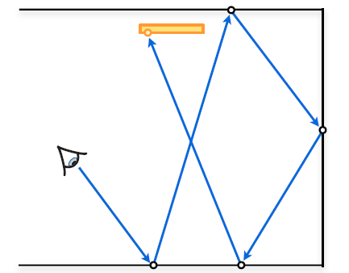
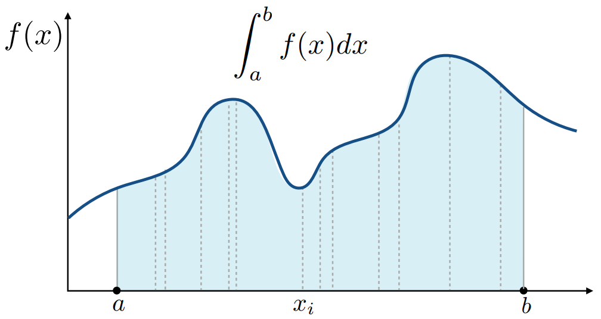
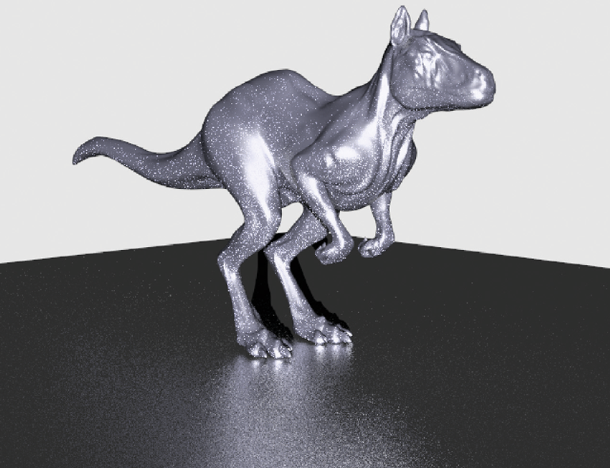
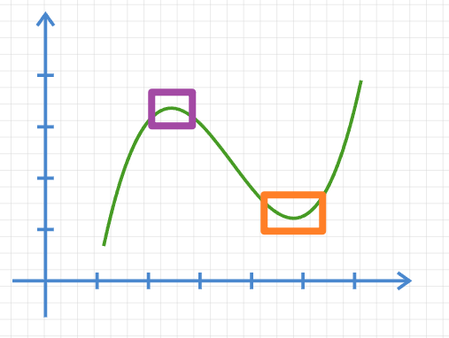
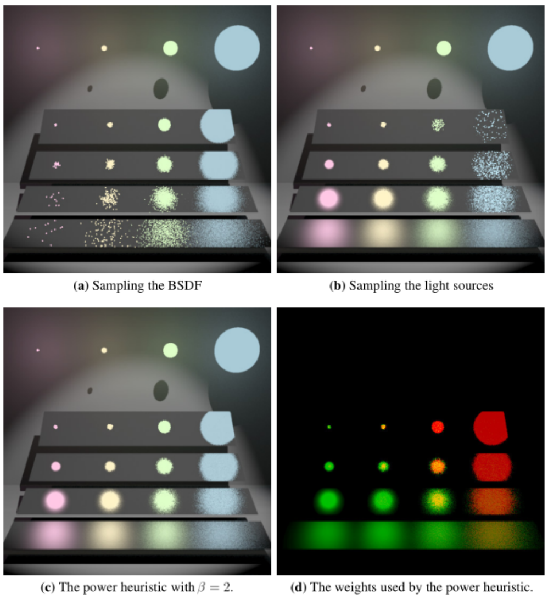
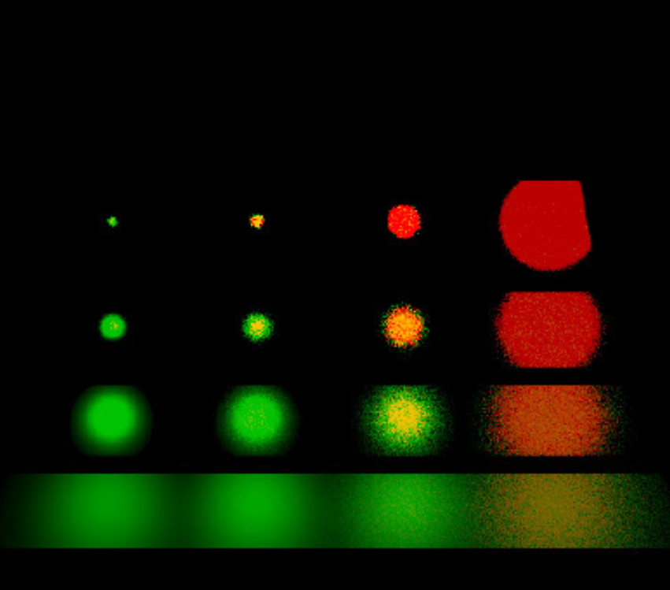

# 蒙特卡洛积分和多重重要性采样：路径追踪的概率基础

2021.12.8 *by indevn*

**目录**

**1.** 问题背景：路径追踪渲染方法及其采样过程

   **1.1** 真实世界中的光照与路径追踪

   ​		**1.1.1** 渲染方程：渲染过程的核心问题

**2.** Monte Carlo 积分：通过概率密度解决积分问题

   **2.1** 一般语境下的均匀采样方法

   **2.2** 重要性采样：更优化的采样策略

   ​		**2.2.1** 重要性采样的基本思想

   ​		**2.2.2** 重要性采样在路径追踪中的应用

**3.** 多重重要性采样及其在路径追踪中的应用

   **3.1** 多采样模型

   **3.2** 权重设定

   

## 1. 问题背景：路径追踪渲染方法及其采样过程

路径追踪（Path Tracing, Kajiya）方法是现代计算机图形学的重要渲染方法。

计算机图形学语境下的渲染（Rendering），是指在计算机中将3D模型显示在计算机屏幕上的过程，将三维场景中的模型按照设定好的环境、灯光、材质及其它渲染参数使其显示于2D的屏幕上。

从2D的屏幕观察3D场景，很容易想到从几何的角度将某个3D模型直接投影到某一2D平面上的过程。但由于实际的渲染中，不同的模型对应着不同的光照和材质特征。在3D动画中，我们可以看到粗糙表面的物体，也可以看到光滑表面的物体，这是我们人眼是可以正确分辨出来的，这也说明其显示效果是不一样的。这实际上是一个有关于光的问题。

对于这样问题的处理，路径追踪是一种效果很好的现代渲染方法。

### 1.1 真实世界中的光照与路径追踪

在真实世界中，我们之所以可以看到物体，是因为光线从光源射出后，经过物体的多次反射最后投入我们的眼睛。我们无法通过肉眼观测到黑洞的形状，也正是因为黑洞将光线吸收，光线没能从黑洞反射并照入我们的眼睛。

路径追踪算法正是希望通过模拟这样的一个过程，实现屏幕上每个像素点接收到的光线（R，G，B）的计算，最终完成整个画面的渲染。但在具体实施中，从光源向外辐射的光线开始计算，会有大量光线最终经过重重反射并不是投射到人眼中（也即计算机屏幕所能观测的“视野”中）。

路径追踪算法实际上是在实现真实世界光照投射的逆过程，只讨论人眼所能接收到的光线：即从视点出发，投射射线到场景中，这条射线遇到不同的反射表面也会进行相应的反射。

真实的观察过程中，光线从光源出发到人眼结束，而这里则从人眼出发到光源结束。这使得通过计算机计算这样的过程变成可能。

同时需要注意的是，在真实过程中，人眼所看到的画面是由无数光线汇聚而成的。同样的，路径追踪算法也是多次进行路径追踪结果，通过很多次的采样最后使得结果逼近真实值。

#### 1.1.1 渲染方程：渲染过程的核心问题

某点的光是自身所发的光和反射自外界的光的累积，整理为渲染方程：
$$
L_r(p,\omega_o)=L_e(x,\omega_o)+\int_{\Omega^+(H^2)} L_i(x,\omega_i)f(p,\omega_i,\omega_o)(\omega_i\cdot n)\,d\omega_i
$$
可简写为：
$$
L=E+KL
$$
篇幅所限，不对其中参数进行赘述。只须知道，此公式代表所有能量等于所有光源辐射出来的能量加上辐射出来被反射的能量，对于这点，可以通过Taylor展开进行推导：
$$
L=E+KL\\(I-K)L=E\\L=(I-K)^{-1}E\\L=(I+K+K^2+K^3+...)E\\L=E+KE+K^2E+K^3E+...(*)
$$
物理上进行理解，即$L=光源+光源弹射一次+光源弹射两次+…$

此时，路径追踪问题转换为了求解积分问题。

## 2. Monte Carlo 积分：通过概率密度解决积分问题

我们所需要处理的渲染方程是一个复杂的积分形式。

一般，我们用数值计算方法（黎曼积分方法）求解积分时，最简单的将积分区间划分为$n$等分，将每一小区间所对应的积分面积近似为长方形，计算在该区间的函数数值并乘以步长，最后将所有小长方形进行相加得到积分结果。

Monte Carlo方法是一大类随机算法的总称，通过随机样本估算真实值。将Monte Carlo方法应用于积分的求解上，可以帮助我们对定积分进行近似，从而估计出积分的值。其基本形式是：
$$
\int f(x)dx\approx\frac{1}{N}\sum^N_{i=1}\frac{f(X_i)}{p(X_i)}
$$
相较于黎曼积分方法，这种方法在数学意义上是无偏的。对此，可以通过求解数学期望进行证明：
$$
E_{X_i-p(x)}(\frac{f(X_i)}{p(X_i)})
=\int \frac{f(x)}{p(x)}p(x)dx
=\int f(x)dx
$$
同时，可以指定分布对被积分函数进行采样，而不用拘于固定步长。也正因如此，Monte Carlo积分方法允许我们使用重要性采样的策略。

### 2.1 一般语境下的均匀采样方法

我们首先以固定步长对应的均匀分布为例，这是更直观的特殊情况。

对函数 $f(x)$ 求其在区间 $[a,b]$ 上的积分 $\int_a^bf(x)dx$ 时，通过概率论采样的方法，在区间 $[a,b]$ 进行采样：
$$
{x_1,x_2,x_3,\,... \,,x_n}\,\,->\,{f(x_1),f(x_2),f(x_3),\,... \,,f(x_n)}
$$
按照Monte Carlo积分，有
$$
\int f(x)dx\approx\frac{1}{N}\sum^N_{i=1}\frac{f(X_i)}{p(X_i)}\quad X_i\sim p(x)
$$
在渲染过程中，我们往往处理的是面积分，但此处先以如上图的线积分为例：

如果我们在这样的过程中遵循均匀采样，则有概率密度函数：
$$
p=\frac{1}{b-a}
$$
代入则有
$$
\int_a^bf(x)dx\approx\frac{b-a}{N}\sum_{i=1}^Nf(x_i)
$$
几何上，$\frac{b-a}{N}$可视作小长方形底部的款，$f(x_i)$则为长。

对于一般的渲染过程，我们往往并不只是处理线上的问题。对半球面作均匀采样均匀采样，我们的概率密度有：
$$
p(w_i)=1/2\pi
$$
对于渲染方程的积分部分，则有
$$
L_o(p,\omega_o)\\=\int_{\Omega^+} L_i(p,\omega_i)f_r(p,\omega_i,\omega_o)(\omega_i\cdot n)\,d\omega_i\\
\approx\frac{1}{N}\sum^N_{i=1}\frac{L_i(p,\omega_i)f_r(p,\omega_i,\omega_o)(\omega_i\cdot n)}{1/2\pi}
$$
由此，我们得到了一个着色点出射的光线多少。

### 2.2 重要性采样：更优化的采样策略

前文通过Monte Carlo 积分对光线进行均匀采样。相比于工程中常用的常规取固定步长的数值积分方法，它在数学上是无偏的。在实际操作中，随着采样数的增长而更加精确。但在渲染领域，受性能限制，我们的抽样数量仍是有限的。

对于有限的采样数量，我们可以通过多重重要性采样进行优化。下图左图是均匀采样的渲染结果，右图是采用重要性采样的渲染结果。

#### 2.2.1 重要性采样的基本思想

在前文中，我们得到了Monte Carlo积分的基本事实：
$$
\int f(x)dx\approx\frac{1}{N}\sum^N_{i=1}\frac{f(X_i)}{p(X_i)}
$$
在上文中，我们对于$p(Xi)$是采用均匀分布。但在很多时候，为了获得我们期望的结果，我们可以对抽样分布进行人为的干预。

这里仍旧首先以一般的线积分为例：

对于如下图函数的积分，根据积分的几何意义，很容易知道紫色区域圈出的部分是要比橙色区域对于积分的作用更大的，如果我们能对于紫色区域在一定程度上有更多的采样，进而增大紫色区域的权重，我们将能得到更加趋于精确值的结果。

上图的函数只是一个简单的例子，具体到图形渲染过程中我们会将这样的结论推广到更高的维度。一般而言，对于渲染过程计算中的被积分面为，考虑被积函数本身的因素，进行权重的分配。

反过来考虑，近似结果的误差和收敛速度主要取决于用来采样的概率密度函数，而后者也就是我们主要讨论的主题。

对此，我们有一个很直观的结论：概率密度函数在图像上越接近于被积函数，收敛速度也就越快。当$p(x)=cf(x)$ ，概率密度函数完全正比于被积函数，方差将为0。可以计算方差进行证明：
$$
V[\frac{1}{N}\sum^N_{i=1}\frac{f(X_i)}{p(X_i)}]=\frac{1}{N}V[\frac{f(x)}{p(x)}]=\frac{1}{N}V[\frac{f(x)}{cf(x)}]=0
$$
由此，我们可以更直观地理解上面的结论：如果可以找到与被积函数 $f(x)$ 形状相似的概率密度函数 $p(x)$ ，结果的方差会减小。反之会增加。

对此，我们应该选用尽量合适的概率密度函数 $p(x)$ 进行采样，而这也正是重要性采样的基本思想。

#### 2.2.2 重要性采样在路径追踪中的应用

回到最初的问题，通过Monte Carlo方法求解渲染方程中的积分：
$$
L_o(p,\omega_o)
\approx\frac{1}{N}\sum^N_{i=1}\frac{L_i(p,\omega_i)f_r(p,\omega_i,\omega_o)(\omega_i\cdot n)}{p(\omega_i)}
$$
$L_o$对应的$L_i(p,\omega_i)f_r(p,\omega_i,\omega_o)(\omega_i\cdot n)$是一个很复杂的形式，我们也很难得到最优的$p(x)=cf(x)$形式，后者要求我们在计算之前提前知道关于$L_i(p,\omega_i)f_r(p,\omega_i,\omega_o)(\omega_i\cdot n)$的所有信息。

但这里，被积函数是多个函数的乘积。构造$p(\omega_i)$使其与完整的乘积形式相似是一件很困难的事情。但我们可以找到与其中一个被乘数相似的$p(\omega_i)$。即对其中的一个被乘数进行采样。

渲染中，称为

## 3. 多重重要性采样及其在路径追踪中的应用

在实践中，重要性采样是渲染中最常用的减少方差的策略。它易于应用，且在很多时候（使用良好的采样分布进行采样时）有很出色的效果。

但如上文所说，$L_i(p,\omega_i)f_r(p,\omega_i,\omega_o)(\omega_i\cdot n)$是一个很复杂的形式，我们更多只是对其中的某一被乘数进行采样。每种采样策略都有不同的优势和劣势。

由此引出一个问题：我们应该选择哪个函数进行重要性采样？如果使用效果不好的概率密度函数 $p(x)$，我们可能会得到比均匀采样更差的结果。

而多重重要性采样正是尝试将不同采样策略结合起来。其基本思路是将多种不同采样方法结合起来，分别采样被积函数的不同部分，最后将不同的采样结果相结合以达到接近于相对更优的结果。

上图是使用不同采样方法进行采样的结果比较。其中，四个板子最上方的最光滑、最下端的最粗糙，*(a)(b)*分别对BSDF和光源进行重要性采样，*(c)*则依据Power heuristic权重设置进行多重重要性采样，*(d)*通过不同颜色表示了不同权重。

### 3.1 多采样模型

在具体估计积分的过程中，我们首先按多个可选的采样分布进行采样，选择其中至少一个与被积函数的形状相似的 $p(x)$。如果使用两个采样分布来估计积分，则有：
$$
\frac{1}{n_f}\sum^{n_f}_{i=1}\frac{f(X_i)g(X_i)w_f(X_i)}{p_f(X_i)}+\frac{1}{n_g}\sum^{n_g}_{i=1}\frac{f(Y_j)g(Y_j)w_f(Y_j)}{p_g(Y_j)}
$$
其中$w_f(X_i)$和$w_g(Y_i)$是加权函数。

推广到$n$中采样分布，每种分布采样$n_i$个点，则有估计：
$$
F=\sum^n_{i=1}\frac{1}{n_i}\sum^{n_i}_{j=1}w_i(X_{i,j}\frac{f(X_{i,j})}{p_i(X_{i,j})})
$$
为了使这个结果仍旧是无偏的，需要满足条件：

1. $\sum^n_{i=1}w_i(x)=1$ whenever $f(x)\neq 0$	所有分布的采样范围的交集充满了积分区域
2. $w_i(x)=0$ whenever $p_i(x)=0$

可通过求期望来证明无偏性，发现估计量的期望值为积分值：
$$
E[F]=\sum^n_{i=1}\frac{1}{n_i}\sum^{n_i}_{j=1}\int_\Omega\frac{w_i(x)f(x)}{p_i(x)}p_i(x)dx=\int_\Omega\sum^n_{i=1}w_i(x)f(x)dx=\int_\Omega f(x)dx
$$

### 3.2 权重设定

对于满足上述条件的加权函数，为了将各个重要性采样分布的优点相结合达到$1+1>1$的效果，我们通常采用两种设置方法：

- Balance Heuristic

  在某点采样的概率密度函数$p(\omega_i)$越大，可见这个函数对应的重要性采样也就越重视这个点，则对其进行增权；在某点采样的概率密度函数$p(\omega_i)$越小，则对其进行降权。

$$
w_s=\frac{n_sp_s(x)}{\sum_in_ip_i(x)}
$$

- Power Heuristic

  在Balance Heuristic的基础上增加指数$\beta$（建议$\beta=2$），使得概率密度函数的差距变得更加明显。

$$
w_s=\frac{n_sp_s(x)^\beta}{\sum_in_ip_i(x)^\beta}
$$

对于第二种方法，按颜色区分权重（红色代表“对BRDF重要性采样”的权重更高，绿色代表“对光源重要性采样”的权重更高，黄色表示两者权重相似），则有以下权重图：

两种方法都满足前文所述的两个条件，可知其结果是无偏估计。

