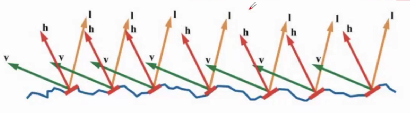

[TOC]

# 渲染方程概述：从BRDF到渲染方程

## 辐射度量学

Difference among three def:

- Irradiance: power per projected unit area

- Intensity: power per solid angle 

- Radiance: Irradiance per solid angle

  Radiance: Intensity per projected unit area

Difference between Irradiance and Radiance:

- Irradiance: total power received by area $dA$

- Radiance: power received by area $dA$ from “direction” $d\omega$

## 双向反射分布函数：对不同材质的描述

双向反射分布函数（BRDF）描述光线和物体材质表面的交互作用，它是对不同材质的描述。它是一个四维函数，在$4\pi$球面度上定义，在表面上的每一个点都有定义。它的四个维度分别是:

- $\Psi$ - 入射方向 $(x_1,y_1)$
- $\Theta$ - 出射方向 $(x_2,y_2)$

BRDF定义为一个比值，是点x处在出射方向$\Psi$上反射的相对辐射亮度与通过不同立体角入射的相对辐照度之比，可表示为

$$
f_r(x,\Psi \to \Theta)=\frac{dL(x\to \Theta)}{dE(x\gets\Theta)}=\frac{dL(x\to \Theta)}{L(x\gets\Theta)cos(N_x,\Psi)d\omega_{\Psi}}
$$
其中，$N_x$是法线向量，$cos(N_x,\Psi)$是法线向量和入射方向向量的余弦，也即入射方向向量在表面上（假设表面是平面）的投影。

### BRDF的性质

1. 互反律
   $$
   f_r(x,\Psi \to \Theta)=f_r(x,\Theta \to \Psi)
   $$
   亦可直接将BRDF表示为
   $$
   f_r(x,\Psi \leftrightarrow  \Theta)
   $$
   
2. 入射与出射亮度的关系

   在不透明的非发射表面点周围的半球上有一些辐照度分布，总反射亮度可表示为
   $$
   dL(x\to\Theta)=f_r(x,\Psi\to\Theta)dE(x\gets\Psi)\\
   L(x\to\Theta)=\int_{\Omega x}f_r(x,\Psi\to\Theta)dE(x\gets\Psi)\\
   L(x\to\Theta)=f_r(x,\Psi\to\Theta)L(x\gets\Theta)cos(N_x,\Psi)d\omega_{\Psi}
   $$

3. 能量守恒

   对于半球上任何入射辐射亮度$L(x\gets \Psi)$的分布，每单位表面积的总入射功率是半球的总辐照度：
   $$
   E=\int_{\Omega x}L(x\gets\Psi)cos(N_x,\Psi)d\omega_\Psi
   $$
   同时，由能量守恒定律，*在某点于某方向*的出射辐射亮度，等于该点*在某点于某方向*上的自发光和*在某点于某方向*上的反射光的辐射亮度，即：
   $$
   L(x\to \Theta) = L_e(x\to\Theta)+L_r(x\to\Theta)
   $$
   可展开为渲染方程：
   $$
   L_o(x,\vec\omega_o)=L_e(x,\omega_o)+\int_{H^2}f_r(x,\vec\omega_o,\vec\omega_i)L_i(x,\vec\omega_i)cos\theta_id\vec\omega_i\\
   $$
   *其中$f_r$是散射函数，即 BRDF方程。余弦项是入射光和法线之间的夹角。*

对于经验模型的BRDF，我们希望它是一个良好的、合理的BRDF，也即需要它满足能量守恒和互反律。

### BRDF示例：漫反射、镜面反射与折射

1. 漫反射
   $$
   f_r(x,\Psi\leftrightarrow\Theta)=\frac{\rho_d}{\pi}
   $$
   其中$\rho_d$反射率是反射能量与入射能量之比。对于基于物理的材质，$\rho _d\in(0,1]$。

2. 镜面

   - 只考虑折射

     按反射定律找到出射方向：假设入射方向$\Psi$，表面法线$N$，反射方向为$R=2(N\cdot\Psi)N-\Psi$

   - 考虑散射

     **方向：**Snell's law

     按Snell's law计算镜面折射方向，即根据$\eta_1sin\theta_1=\eta_2sin\theta_2$，则有透射光线
     $$
     T=-\frac{\eta_1}{\eta_2}\Psi+N(\frac{\eta_1}{\eta_2}cos\theta_1-\sqrt{1-(\frac{\eta_1}{\eta_2})^2(1-cos^2\theta_1)}\\
     =-\frac{\eta_1}{\eta_2}\Psi+N(\frac{\eta_1}{\eta_2}cos\theta_1-\sqrt{(1-(\frac{\eta_1}{\eta_2})^2(1-N\cdot\Psi)^2}
     $$
     同时须考虑到内全反射（考虑临界角）。
   
     **能量：**Fresnel Equations

     上述等式考虑到了反射和折射方向（角度），菲涅尔方程则考虑到了能量。

   - 透明表面的互反律

     使用BSDF描述透明面时，需要注意透明表面可能不具备互反律。

     

## 着色模型：对不同材质的理想近似

Shading: The process of applying a material to an object.

在光线追踪中，如何对光的行为进行描述？在图形显示中，研究光的传输和能量的增减，本质上为了得到光作用到具体物体上的状态（对应颜色空间当中的颜色），即本质上是在研究光线与不同物体之间的作用。

光线与物体的交互，可以粗浅分为两种：发生吸收和发生散射。散射又分为反射和透射。其中反射分为高光反射Specular和漫反射Diffuse。

光线与不同物体间进行交互会反映出不同的视觉状态，这是取决于物体本身的材质Material，所以，应用不同的材质Material，本质上也是着色问题。

常见的光照模型有两种：

- 标准光照模型：Blinn-Phong光照模型（经验模型，实时中常用）
- 基于物理的BRDF模型

我们首先讨论Blinn-Phong光照模型。

### 标准着色模型

标准着色模型一般指经验模型：Blinn-Phong Reflection Model

**Shading is Local 局部着色**

对于任何着色点，我们定义以下量：

- Surface normal, n ：法线，垂直于反射面
- View direction, v ：观察方向
- Light direction, l ：光照方向

同时我们还需要考虑物体表面的参数，如颜色color、亮度shininess等。

按照Blinn-Phong模型，考察一个点的亮度、颜色，需要考虑：

- **自发光(Emissive)**

  直接采用材质的属性

- **漫反射(Diffuse)**

  关注入射光线的角度，符合Lambert’s Law。

- **高光(Specular)**

  描述向完全镜面反射方向散射的辐射量

- **环境光(Ambient)**

  全局变量。

（着色不考虑其它物体的存在，只考虑其自身，所以没有阴影。）

==**Diffuse 漫反射**==

> Lambert's Cosine Law：
>
> Lambert余弦定律说明，接收到的光线能量*与接收方向和法线方向的夹角的余弦（向量点乘的结果）* 成正比。

物体辐射/发散的光线（能量）的到达 Light Falloff : 接收的强度与和到光源的距离成平方反比

漫反射计算公式：
$$
L_d = k_d\frac{I}{r^2} \,max(0,\vec n\cdot \vec l)
$$
参数说明：

- $L_d$是漫反射光；

- $k_d$是漫反射系数

  代表吸收率，它可以是一个三通道的颜色RGB值，用于定义颜色（吸收某些颜色，不吸收某些颜色。如果用 RGB 定义一个向量作为吸收率，就可以代表这个反射点的颜色。

- 反射方向在反方向的光线是对该点没有贡献的，这里对$n\cdot l$为负的情况进行舍弃。

==**Specular Term 高光**==

高光反射也是镜面反射。对于理想的镜面模型，反射角等于入射角。也即，当我们的观察方向与反射角方向一致时，可以看到高光。

我们考虑用*半程向量和法线* 的接近程度来描述*观察方向和反射角* 的接近程度，其中半程向量是标准化的：
$$
\vec h=bisector(\vec v,\vec l)=\frac{\vec v+\vec l}{||\vec v+\vec l||}
$$
高光计算公式：（Blinn模型）
$$
L_s=k_s\frac{I}{r^2}\,max(0,\vec n\cdot \vec h)^p
$$
参数说明：

- $p$作为cos项的指数，体现为材质的光泽度gloss或反光度shiness。

  由于余弦函数的容忍度很高，我们却希望控制当角度偏离时看不到高光，则采取指数$p$进行控制。一般而言$p \in[100,200]$。

  

  

Specular有Phong模型和Blinn模型两种策略，其中Blinn模型采用了半程向量进行计算，而Phong模型直接进行计算。

在camera和光源距离模型<u>足够远</u>时，Blinn模型更快（$\hat h$可视为常量，$\hat v$,$\hat l$可视为定值），同时在一些情形中，Blinn更符合真实。

==**Ambient 环境光照**==

假设：任何点所接收的环境光都是相同的。我们认为这是常数，即
$$
L_a=k_aI_a
$$
Add constant color to account for disregarded  illumination and fill in black shadows.

**This is approximate / fake!**

**==反射模型==**

对于整体的Blinn-Phong反射模型，可表示为
$$
L=L_a+L_d+L_s=k_aI_a+k_d\frac{I}{r^2}max(0,\vec n \cdot \vec l)+k_s\frac{I}{r^2}max(0,\vec n \cdot \vec h)^p
$$

但同时，Blinn-Phong模型仍有很多缺陷，无法模拟很多重要的物理现象，如菲涅尔反射、各向异性。

### 基于物理的BRDF

在实时渲染领域，Physically-Based Rendering一般即指材质。但它们基本都不是physically based的，做了大量简化和hack。

对表面一般有两类：

- 微表面模型 Microfacet Models
- Disney Principled BRDFs

对Volumes，则通常可分为以下两类：

- single scattering
- multiple scattering(for cloud, hair, skin, etc.)

按上面的BRDF性质，我们可以看到，一个合理的（基于物理的）BRDF，应该至少满足下面两个性质：

- 双向传播
  $$
  \rho(V,L)=\rho(L,V)
  $$

- 能量守恒

  能量可以拆成两个部分：漫反射部分和高光反射部分。
  $$
  \rho(V,L)=kK_d+(1-k)\rho_s(V,L)
  $$

#### 微表面模型

微表面模型（Microfacet Material）是更接近于物理的材质描述，相比于Lambertian模型、Phong模型，它可以用来描述更复杂的场景。

我们认为广表面（Macrosurface） 是平坦且粗糙的，但是微表面（Microsurface）是凹凸不平但是光滑的（每一个小的面都是光滑平坦的）。粗糙的广表面是由一个个微表面组成，微表面是完美的平面，其朝向不同。

对于微表面模型，整体的光线反射情况应当是所有微表面反射情况的总和。从近处看是几何，从远处看就是一种材质。

**微表面模型**

广表面的粗糙程度取决于微表面的法线的方差，法线方差越大，广表面越粗糙。

对于微表面的不同材质，可以考虑通过微表面法线分布进行表示：
$$
f(i,o)=\frac{F(i,h)G(i,o,h)D(h)}{4(n,i)(n,o)}
$$
其中$F(i,h)$即菲涅尔项Fresnel Term，$G(i,o,h)$是几何项 Shadowing-masking term，，$D(h)$是沿着半程向量的**法线分布**。

**不同的法线分布模型**

对于微表面模型，最重要的实际是微表面自身的**法线分布NDF**（Normal Distribution Function）。对于任何一种材质，我们使用法线分布来描述其材质。如果是光滑glossy的表面，那么法线分布比较集中；否则，法线会分布在四处，呈现出类似diffuse的效果。

有不同的模型可以描述这样的分布，如Beckmann、GGX等模型。

- Beckmann NDF

    即一个法线方向的函数，它类似于Gaussian高斯函数，它定义在坡度空间Slope Space上（保证微表面的面不会朝下）：
    $$
    D(h)=\frac{e^{-\frac{tan^2\theta_h}{\alpha^2}}}{\pi\alpha^2cos^4\theta_h}
    $$
    其中，$\alpha$描述法线的粗糙程度，粗糙程度越小效果越接近镜面反射。$\theta_h$则是半程向量$h$和法线$n$的夹角。

- GGX/Trowbridge-Reitz NDF

    函数图像的突出特征在于其“长尾巴”，会呈现出“光晕”的效果

    - Extending GGX: GTR(Generalized Trowbridge-Reitz)

      “更长的尾巴”

**Cook-Torrance模型**

前面提到，将物体表面表面视为一个个微小的随机排布，其理想镜面反射受FDG三项控制
$$
f_r(w_o,w_i)=\frac{k_d}{\pi}+\frac{k_s}{4\pi(n\cdot w_i)}D(h)F(w_o)G(w_o,w_i)
$$

第一项是一个常数，对应漫反射的BRDF：
$$
\frac{k_d}{\pi}
$$

> ==证明==
>
>   - 若完全不吸收，全部反射出去
>
> $$
> dC_R=\rho_0C_E(L)(N\cdot L)dw\\
>   C_R=\int_\Omega\rho_0C_E(L)(N\cdot L)dw\\
>   C_R=\rho_0C_R\int_{H^2}cos\theta_idw\\
>   \rho_0=\frac{1}{\pi}
> $$
>
>   - 若存在吸收
>     $$
>     \rho_0=\frac{K_d}{\pi}
>     $$
>     其中$K_d$是漫反射的衰减系数，物理含义即漫反射颜色。

第二项对应的是复杂的高光反射：
$$
\frac{k_s}{4\pi(n\cdot w_i)}D(h)F(w_o)G(w_o,w_i)
$$

> ==参数说明==
>
> - 菲涅尔现象
>
>   由$F(\omega_o)$ 菲涅尔项进行描述。给定入射光线角度和材质信息，求反射的比例（水面垂直的看通透，斜看如镜子）
>
>   Schlick对F的近似估计：
>   $$
>   入射角为0°时,\,\,F_0=(\frac{\eta_\lambda-1}{\eta_\lambda+1})^2\\
>   F_{Schlick}=F_0+(1-F_0)(1-cos\theta_d)^5
>   $$
>
> - 表面自遮挡
>
>   我们提供了几何项G，用于解决微表面间的自遮挡问题。提供了变暗的操作。在接近垂直方向时，不会变暗；在接近grazing angle时，会剧烈减小。
>
>   由$G(w_0,w_i)$几何项进行描述：
>   $$
>   \int_\Omega G_1(m,v)D(m)(v\cdot m)^+dm=v\cdot n
>   $$
>   表示宏观投影结果等于正面投影结果之和$(v\cdot m)^+$
>
>   
>
>   对于CT模型，照到一个微平面的光线可能会被相邻的微平面遮挡，微表面的反射光线也可能会被相邻微表面遮挡。
>
>   而CT模型无法在G项描述对微平面进行二次反射。
>
>   Decoupling shadowing and masking:
>
> $$
> G(i,o,m)\approx G_1(i,m)G_1(o,m)
> $$
>
> 
>
> - $D(w_o)$
>
>   法线分布函数(Normal Distribution Function)，其代表了所有微观角度下微小镜面法线的分布情况，粗糙表面法线分布相对均匀，光滑表面法线分布相对集中。
>
>   微平面分布函数是用来描述微平面上法向量与半程向量H相同的比例，即用来描述法向量方向和H相同的微平面数量/面积
>   $$
>   dA_h=D(\omega_h)d\omega_hdA
>   $$
>   在H方向入射的辐射通量为：
>   $$
>   d\Phi=C_i(\omega_i)cos\theta_hd\omega_idA_h=C_i(\omega_i)d\omega_icos\theta_hD(\omega_h)d\omega_hA
>   $$
>   忽略F，G的影响，可以认为入射的辐射通量等于出射的辐射通量。
>
>   根据Radiance定义
>   $$
>   dC_R(\omega_R)=\frac{d\Phi_R}{d\omega_Rcos\theta_RdA}=\frac{C_i(\omega_i)d\omega_icos\theta_hD(\omega_h)d\omega_hA}{d\omega_Rcos\theta_RdA}
>   $$
>
>   根据BRDF的定义，可得到高光反射的BRDF：
>   $$
>   \rho_s=\frac{\mathrm{d}C_R}{C_icos\theta_i\mathrm{d}\omega_i}=\frac{cos\theta_hD(\omega_h)\mathrm{d}\omega_h}{cos\theta_Rcos\theta_i\mathrm{d}\omega_R}
>   $$
>   代入立体角积分公式
>   $$
>   \mathrm{d}\omega=\frac{\mathrm{d}A}{r^2}=sin\varphi \mathrm{d}\theta\mathrm{d}\varphi
>   $$
>   由于出射方向和观察方向重合，半程向量恰为反射光线的对称轴，则角度翻倍：（为什么要代入？）
>   $$
>   \mathrm{d}\omega_h=sin\theta_h \mathrm{d}\theta_h\mathrm{d}\phi\\
>   \mathrm{d}\omega_R=sin(2\theta_h) \mathrm{d}(2\theta_h)\mathrm{d}\phi\\
>   \frac{\mathrm{d}\omega_h}{\mathrm{d}\omega_R}=\frac{1}{4cos\theta_h}
>   $$
>   将12带入到10中，则得到了
>   $$
>   \rho_s=\frac{D(\omega_h)}{4cos\theta_Rcos\theta_i}
>   $$
>   加入F、G的影响，则得到
>   $$
>   \rho_s=\frac{D(h)F(w_o)G(w_o,w_i)}{4cos\theta_Rcos\theta_i}
>   $$

**能量损失问题**

在基本的模型基础上，我们也需要讨论微表面模型的能量损失问题。

在不同的roughness下，会有不同的能量损失。在rough时会损失更多能量。越粗糙的表面，在表面多次弹射的可能性越大，也就会有更多的能量损失。

在离线渲染领域的解决方案是在微表面上实现一个类似于光线追踪的东西。实时渲染则采用***Kulla-Conty近似***，其核心思路在于“<u>被遮挡则会发生下次弹射</u>”。

***Kulla-Conty近似***

我们首先计算弹射出的总能量：
$$
E(\mu_o)=\int^{2\pi}_0\int^1_0f(\mu_o,\mu_i,\phi)\mu_id\mu_id\phi,\mu=sin\theta
$$
对于某种BRDF，我们只需补上$1-E(\mu_o)$的能量即可。也即我们补上另外一种BRDF使其积分出来的能量等于$1-E(\mu_o)$。同时我们需要考虑其对称性，也即它的形式有：
$$
c(1-E(\mu_i))(1-E(\mu_o))
$$
其中$c$是用于归一化的量：
$$
f_{ms}(\mu_o,\mu_i)=\frac{(1-E(\mu_o))(1-E(\mu_i))}{\pi(1-E_{avg})},E_{avg}=2\int^1_0E(\mu)\mu d\mu
$$
代入可验证。

此时$E_{avg}(\mu_o)=2\int^1_0E(\mu_i)\mu_id\mu_i$仍旧是未知的，为了减少计算成本，我们可以预计算/打表。

$E_{avg}$仅依赖于参数$\mu_o$和*roughness*，我们可以对这两个数算出所有的组合（一张二维表）。

如果原本的BRDF有颜色，颜色意味着吸收了某些光，也就意味着能量损失。我们仍是只需要计算总体能量。

我们定义一个平均分量Frensel，用于表示平均每次有多少能量被反射：
$$
F_{avg}=\frac{\int^1_0F(\mu)\mu d\mu}{\int^1_0\mu d\mu}=2\int^1_0F(\mu)\mu d\mu
$$
我们可以直接看到的能量即$F_{avg}E_{avg}$；再一次反射后即$F_{avg}(1-E_{avg})\cdot F_{avg}E_{avg}$；第k次反射后即$F^k_{avg}(1-E_{avg})^k\cdot F_{avg}E_{avg}$，将所有可能的能量相加则有级数：
$$
\frac{F_{avg}E_{avg}}{1-F_{avg}(1-E_{avg})}
$$
即颜色项Color Term。

#### Disney Principled BRDFs

Microfacet不擅长表示某些真实材质，不能模拟所有真实材质。

同时，它对于artist而言并不友好，它基于物理，有很多物理参量，并不适合艺术家的设计。对此，我们需要一个artist friendly的材质，其代表就是Disney principled BRDF。

它基于以下重要原则设计：

1. 效果直观，利于艺术家使用
2. 尽量少的参数
3. 参数的可取值在0-1的范围内，利于调节
4. 所有参数的组合是鲁棒的，都可以得到确定的结果

Disney principled BRDF的设计，在很多时候都是建立在拟合的基础上，所以是能量守恒的，是经验性的。

它提供了很多参数，允许基于直观设计出各种效果。但同时，参数空间越大越容易造成冗余。同时，过大的参数空间难以去学习和训练。

它有开源实现。这并不是基于物理的，但我们仍旧称之为PBR材质。

## 蒙特卡洛积分方法：对连续光能传输函数进行采样

我们所需要处理的渲染方程是一个复杂的积分形式。

一般，我们用数值计算方法（黎曼积分方法）求解积分时，最简单的将积分区间划分为$n$等分，将每一小区间所对应的积分面积近似为长方形，计算在该区间的函数数值并乘以步长，最后将所有小长方形进行相加得到积分结果。

Monte Carlo方法是一大类随机算法的总称，通过随机样本估算真实值。将Monte Carlo方法应用于积分的求解上，可以帮助我们对定积分进行近似，从而估计出积分的值。其基本形式是：
$$
\int f(x)dx\approx\frac{1}{N}\sum^N_{i=1}\frac{f(X_i)}{p(X_i)}
$$
相较于黎曼积分方法，这种方法在数学意义上是无偏的。对此，可以通过求解数学期望进行证明：
$$
E_{X_i-p(x)}(\frac{f(X_i)}{p(X_i)})
=\int \frac{f(x)}{p(x)}p(x)dx
=\int f(x)dx
$$
同时，可以指定分布对被积分函数进行采样，而不用拘于固定步长。也正因如此，Monte Carlo积分方法允许我们使用重要性采样的策略。

## 渲染方程：描述光能的整体平衡分布

渲染方程用于描述场景中光能的平衡分布，对于任意表面点和方向，渲染方程给出最后的出射辐射亮度$L(x\to\Theta)$

**半球形公式**是最常用的渲染方程形式。

按照BRDF定义，
$$
f_r(x,\Psi \to \Theta)=\frac{dL_r(x\to \Theta)}{dE(x\gets\Theta)}
$$
其中，
$$
L_r(x\to\Theta)=\int_{\Omega_x}f_r(x,\Psi\to\Theta)L(x\gets\Psi)cos(N_x,\Psi)d\omega_{\Psi}
$$
则得到第二种弗雷德霍姆方程形式的渲染方程：
$$
L(x\to\Theta)=L_e(x\to\Theta)+\int_{\Omega_x}f_r(x,\Psi\to\Theta)L(x\gets\Psi)cos(N_x,\Psi)d\omega_{\Psi}
$$

**区域公式**则是将定义域

## 减小方差

### 重要性采样：对渲染方程收敛速度的优化

### 分层采样：减小方差

